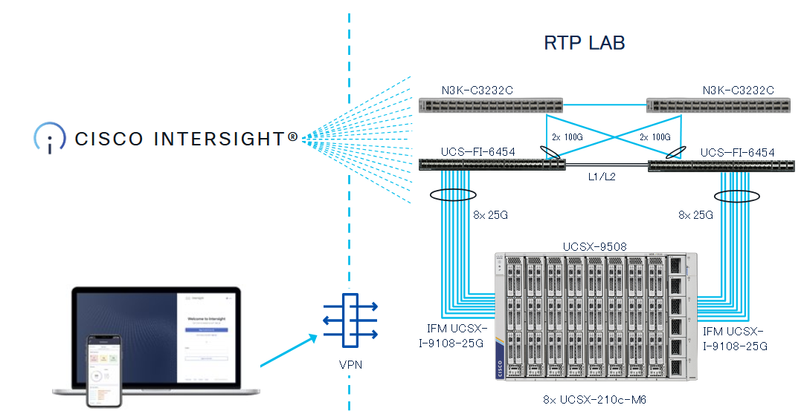

# Network Diagram

Because Intersight is a SaaS platform, there is no need to use VPN to the physical hardware,

which is located in RTP, NC.

Here is a very simplistic overview of the Network Diagram.

<figure>

</figure>

You can connect with the laptop to Intersight and do all tasks, steps of this lab. For this lab, every participant wil have one physical server to configure.

**DO NOT CHANGE THE CHASSIS or DOMAIN POLICIES**

This will have an influence on everybody who is working in the lab.
