# Task 1: Let’s start with the lab!

## Step 1: Login Into Intersight

Below are the details for each pod. On the piece of paper you will see your pod number. You can use those details to login and shows you which server is assigned to you.

| **Pod** | **Username** | **Password** | **Server** | **IMM Domain** | **VLAN** | **User Label** |
|:--:|:--:|:--:|:--:|:--:|:--:|:--:|
| 1 | ucsx01@intersighttme.de | <UCSX@Cisco123> | int-ucs-4-1-1 | int-ucs-4 | 701 | SRV1 |
| 2 | ucsx02@intersighttme.de | <UCSX@Cisco123> | int-ucs-4-1-2 | int-ucs-4 | 702 | SRV2 |
| 3 | ucsx03@intersighttme.de | <UCSX@Cisco123> | int-ucs-4-1-3 | int-ucs-4 | 703 | SRV3 |
| 4 | ucsx04@intersighttme.de | <UCSX@Cisco123> | int-ucs-4-1-4 | int-ucs-4 | 704 | SRV4 |
| 5 | ucsx05@intersighttme.de | <UCSX@Cisco123> | int-ucs-4-1-5 | int-ucs-4 | 705 | SRV5 |
| 6 | ucsx06@intersighttme.de | <UCSX@Cisco123> | int-ucs-4-1-6 | int-ucs-4 | 706 | SRV6 |
| 7 | ucsx07@intersighttme.de | <UCSX@Cisco123> | int-ucs-4-1-7 | int-ucs-4 | 707 | SRV7 |
| 8 | ucsx08@intersighttme.de | <UCSX@Cisco123> | int-ucs-4-1-8 | int-ucs-4 | 708 | SRV8 |
| 9 | ucsx09@intersighttme.de | <UCSX@Cisco123> | int-ucs-5-1-1 | int-ucs-5 | 709 | SRV9 |
| 10 | ucsx10@intersighttme.de | <UCSX@Cisco123> | int-ucs-5-1-2 | int-ucs-5 | 710 | SRV10 |
| 11 | ucsx11@intersighttme.de | <UCSX@Cisco123> | int-ucs-5-1-3 | int-ucs-5 | 711 | SRV11 |
| 12 | ucsx12@intersighttme.de | <UCSX@Cisco123> | int-ucs-5-1-4 | int-ucs-5 | 712 | SRV12 |
| 13 | ucsx13@intersighttme.de | <UCSX@Cisco123> | int-ucs-5-1-5 | int-ucs-5 | 713 | SRV13 |
| 14 | ucsx14@intersighttme.de | <UCSX@Cisco123> | int-ucs-5-1-6 | int-ucs-5 | 714 | SRV14 |
| 15 | ucsx15@intersighttme.de | <UCSX@Cisco123> | int-ucs-5-1-7 | int-ucs-5 | 715 | SRV15 |
| 16 | ucsx16@intersighttme.de | <UCSX@Cisco123> | int-ucs-5-1-8 | int-ucs-5 | 716 | SRV16 |
| 17 | ucsx17@intersighttme.de | <UCSX@Cisco123> | int-ucs-6-1-1 | int-ucs-6 | 717 | SRV17 |
| 18 | ucsx18@intersighttme.de | UCSX@Cisco123 | int-ucs-6-1-2 | int-ucs-6 | 718 | SRV18 |
| 19 | ucsx19@intersighttme.de | UCSX@Cisco123 | int-ucs-6-1-3 | int-ucs-6 | 719 | SRV19 |
| 20 | ucsx20@intersighttme.de | UCSX@Cisco123 | int-ucs-6-1-4 | int-ucs-6 | 720 | SRV20 |
| 21 | ucsx21@intersighttme.de | UCSX@Cisco123 | int-ucs-6-1-5 | int-ucs-6 | 721 | SRV21 |
| 22 | ucsx22@intersighttme.de | UCSX@Cisco123 | int-ucs-6-1-6 | int-ucs-6 | 722 | SRV22 |
| 23 | ucsx23@intersighttme.de | UCSX@Cisco123 | int-ucs-6-1-7 | int-ucs-6 | 723 | SRV23 |
| 24 | ucsx24@intersighttme.de | UCSX@Cisco123 | int-ucs-6-1-8 | int-ucs-6 | 724 | SRV24 |
| 25 | ucsx25@intersighttme.de | UCSX@Cisco123 | int-ucs-7-1-1 | int-ucs-7 | 725 | SRV25 |
| 26 | ucsx26@intersighttme.de | UCSX@Cisco123 | int-ucs-7-1-2 | int-ucs-7 | 726 | SRV26 |
| 27 | ucsx27@intersighttme.de | UCSX@Cisco123 | int-ucs-7-1-3 | int-ucs-7 | 727 | SRV27 |
| 28 | ucsx28@intersighttme.de | UCSX@Cisco123 | int-ucs-7-1-4 | int-ucs-7 | 728 | SRV28 |
| 29 | ucsx29@intersighttme.de | UCSX@Cisco123 | int-ucs-7-1-5 | int-ucs-7 | 729 | SRV29 |
| 30 | ucsx30@intersighttme.de | UCSX@Cisco123 | int-ucs-7-1-6 | int-ucs-7 | 730 | SRV30 |

With the browser, goto: <https://intersight.com>

You will see the following screen (figure 2):

<figure>
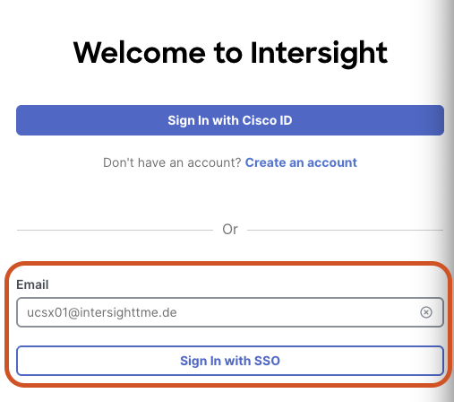
</figure>

Use the email address given to you, see Table 1, to sign in with SSO.

It is possible that you see the following message:

<figure>
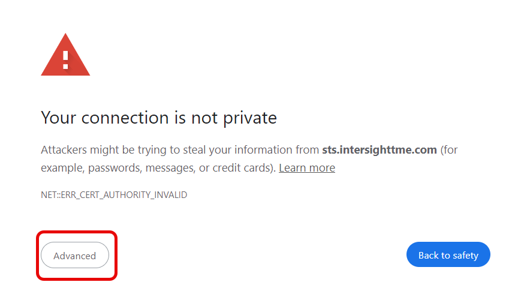
</figure>

Just click on Advanced and Proceed to sts.intersighttme.de.

<figure>
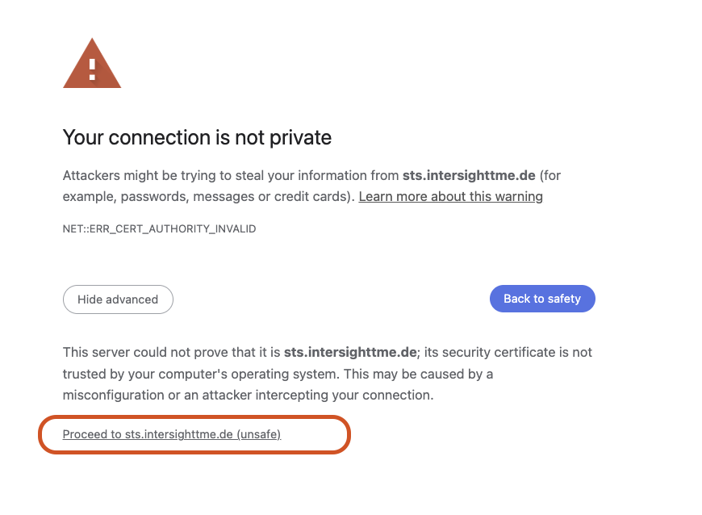
</figure>

Here you can fill in the password, given to you in table 1. Make sure you only input just the user in the username field, not the user@domain as shown in the example below:

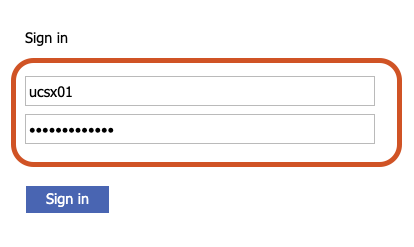

If you see this error message, please try to login again:

<figure>
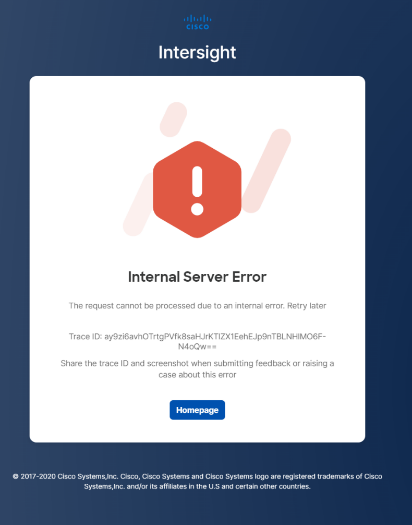
</figure>

If you successfully log in, you should see a screen similar to the image below:

<figure>
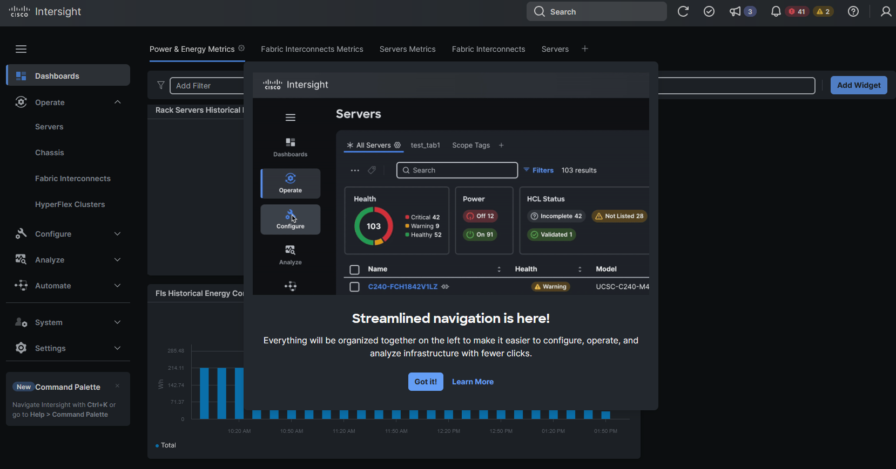
</figure>

If you don’t see the **Dashboards** page, click on **Dashboards** from the left navigation pane:

<figure>
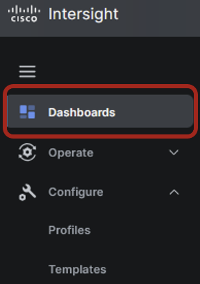
</figure>

## Resource Groups Overview

The slide below shows that Resource group is a way to do Roll Based Access:

<figure>
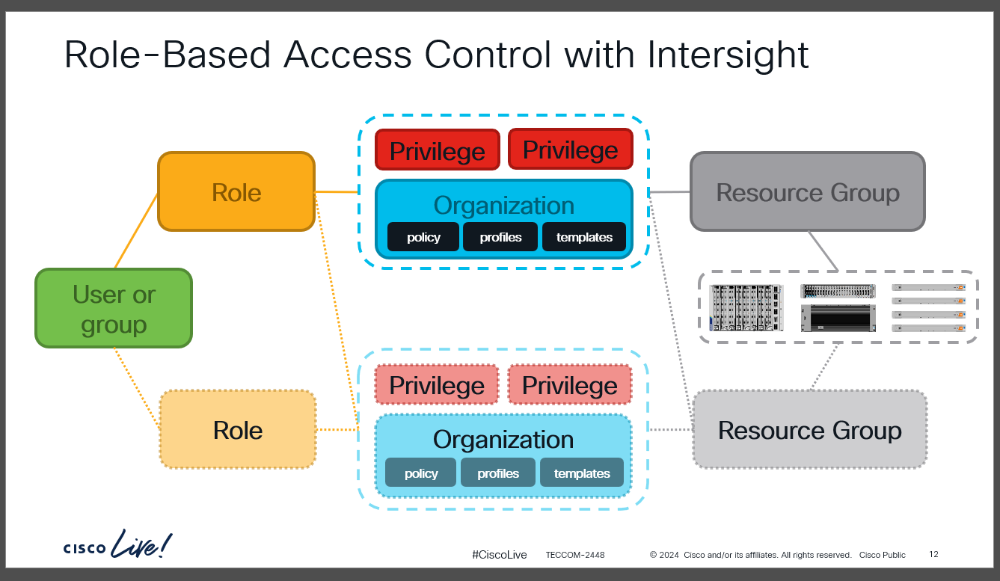
<figcaption>
Figure 9
</figcaption>
</figure>

In this lab, we are sharing devices, like Fabric Interconnects and servers, with another Lab Workshop. When creating new policies in this lab, you will see the organizations **X-Series-Configuration** and **UCSX-Lab-Resources** in the dropdown box similar to the image below:

<figure>
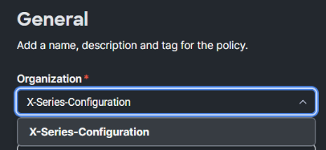
<figcaption>
0
</figcaption>
</figure>

The **UCSX-Lab-Resources** organization is read-only. You can use those configurations if you want and if directed to do so.

Here is an example where the UCSX-Power policy is in the Organization UCSX-LAB-RESOURCES

<figure>
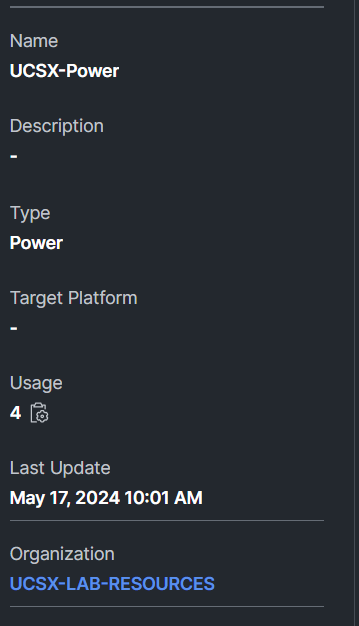
<figcaption>
Figure 11
</figcaption>
</figure>

## Tags, Filters and User Labels

During this lab, we will be creating policies. When creating policies, you can work with Tags. This can make life easier to search for specific parameters. For the following upcoming tasks, please use your pod number.

To set up a Tag in a policy, enter a name and colon in the Set Tags Field (i.e. *Example: POD:1)* and then hit enter. You will see **POD 1** in grey (Figure 13)

<figure>
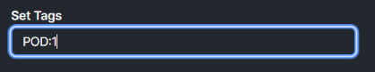
</figure>

<figure>
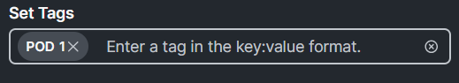
</figure>

There are filters, and there are different ways to use them. You can start typing a text and hit enter. Now, you will see the policies with that search text in them.

<figure>
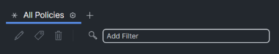
</figure>

<figure>
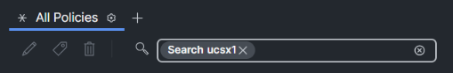
</figure>

<figure>
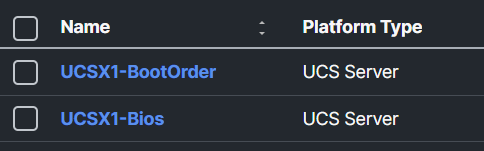
</figure>

In the lab, you will also be able to search on the **TAGS**. Just enter the tag name, and you will see a selection.

Later in the lab after you have created profiles, you can enter the tag key followed by **:** and then choose the TAG numbers similar to the image below:

<figure>
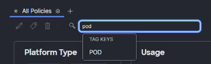
</figure>

<figure>
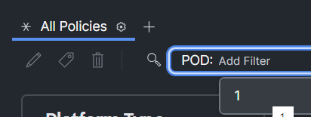
</figure>

Now you will see only the results with the tag **POD:1**

<figure>
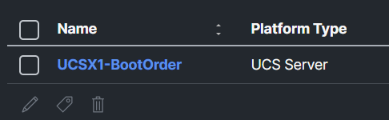
</figure>

**User Labels**

Intersight can manage thousands of servers and have users assigned to servers to make life easier for a systems administrator by implementing **User Labels**.

This can be accomplished from the Servers section under Intersight.

<figure>
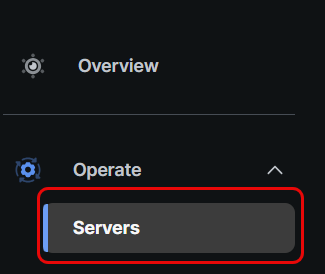
</figure>

Locate the server assigned to you from the lab guide and click on the three dots next to your assign server. Next, select **System** and then select **Set User Label** as shown in the image below:

<figure>
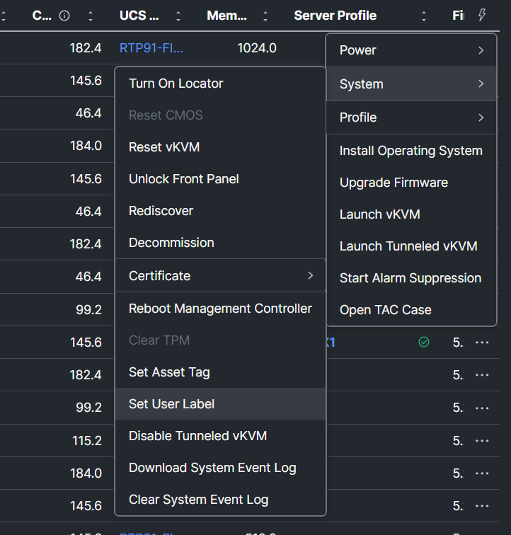
</figure>

At this moment, you may not see the user labels at the server overview. To enable the column, click **Settings** next to the All Servers tab and select **edit** as shown in the image below:

<figure>
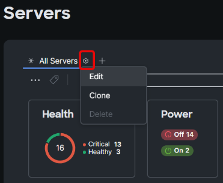
</figure>

Now, scroll down and select **User Label** then select **Save:**

<figure>
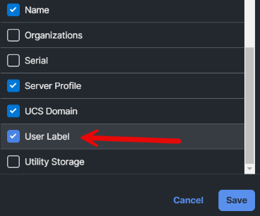
</figure>

Now you will see the User Label and you can filter on it or move it to the first column:

<figure>
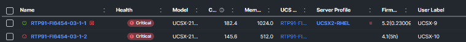
</figure>
