# Task 2: Configuring Fabric Interconnects

## UCS Domain Policy

One of the first steps is to Claim a Target. Once a target is claimed, it will be visible from Intersight. **During this lab, we are not going over the procedure to claim a target.**

Once the FI is claimed, a UCS Domain Profile will need to be created. In this lab, UCS Domain Profiles are already created and assigned to the FIs.

Below is an overview of the Domain and Chassis profile and what you can configure.

<figure>
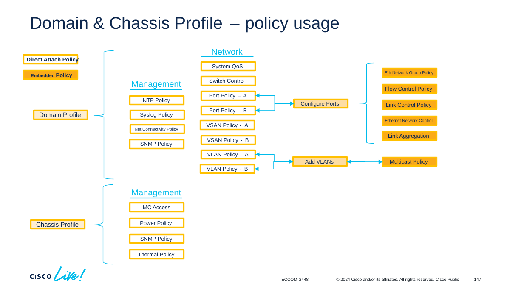
</figure>

We are going over the steps to configure a UCS Domain Profile Template and create a UCS Domain Profile from this to give you a look and feel. **PLEASE DO NOT ASSIGN YOUR TEMPLATE TO A FABRIC INTERCONNECT!** This will be disruptive for you and all other participants.

Step 1: From Intersight, navigate to the **Templates** section on the left under **Configure**, select the **UCS Domain Profile Templates** tab, and then select **Create UCS Domain Profile Template**:

<figure>
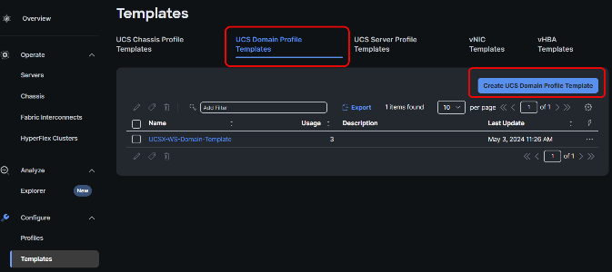
</figure>

Create an unique name using your assigned pod information for the template, provide a unique tag, and select **Next**:

<figure>
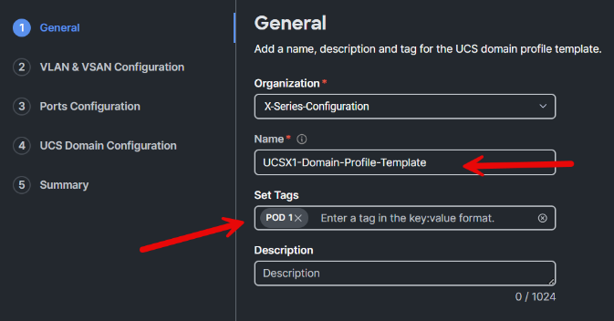
</figure>

Step 2: After having entered a name for the Profile Template, let’s configure the VLAN and VSAN for Fabric Interconnect A and B. In the **VLAN & VSAN Configuration** step, click **Select Policy** for Fabric Interconnect A’s VLAN Configuration:

<figure>
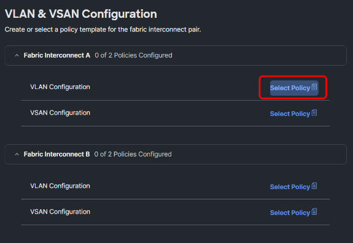
</figure>

Create a new VLAN Policy.

<figure>
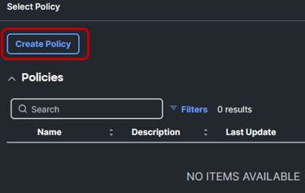
</figure>

Give the VLAN Policy an unique name associated with your Pod, set the tag, and select **Next**:

<figure>
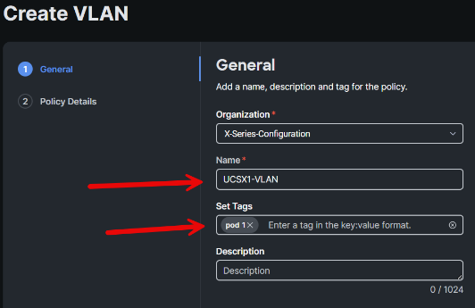
</figure>

There is only VLAN 1 (the default VLAN) in this configuration and for the lab we are using VLAN 70. Click **Add VLANs**:

<figure>
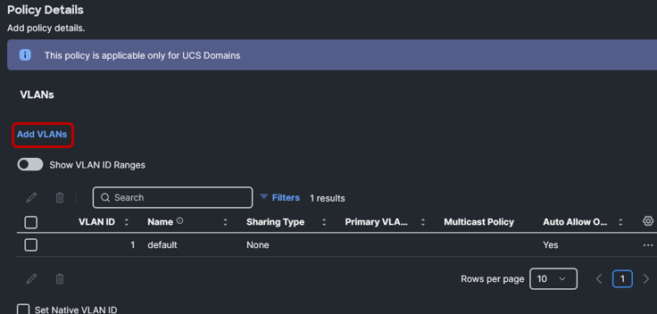
</figure>

Fill in the prefix with a prefix for the VLAN name and use the VLAN ID **70**. Click **Select Policy** for the Multicast Policy and then click **Create Policy** when prompted to select policy

<figure>
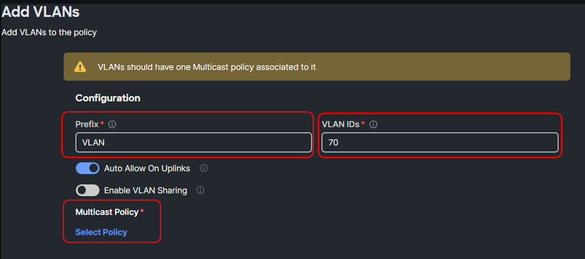
</figure>

Provide a new Multicast Policy a name, a tag, and click **Next**:

<figure>
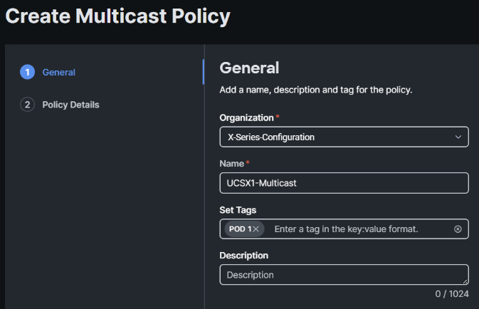
</figure>

The default parameters are for the majority of UCS Customers. A Multicast Policy must be attached to all created VLANs. We will not be changing the settings for this lab, but below are some best practices for these policy details**:**

- IGMP Snooping is needed to have the FI correctly populate Multicast Groups.

- Querier State must be enabled if the upstream TOR/EOR Switch does not provide multicast querier service. If enabled, you must provide IPv4 addresses for the Querier and Peer.

- Disable Source IP Proxy when the upstream Firewall or Switch does not accept FI Source IP Proxy.

<figure>
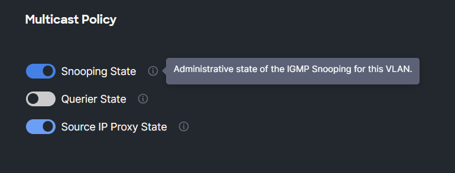
</figure>

Click **Create**.

Now you should see the Multicast Policy you just created as shown below:

<figure>
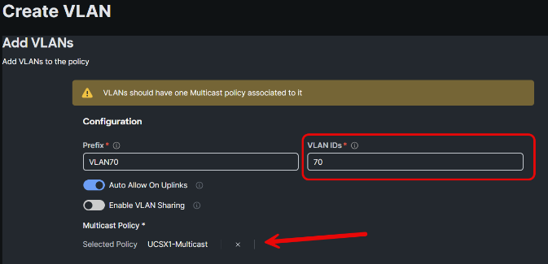
</figure>

Now click **Add.**

Depending on how the current network is configured, a Native VLAN ID can be set if necessary. Click **Create**:

<figure>
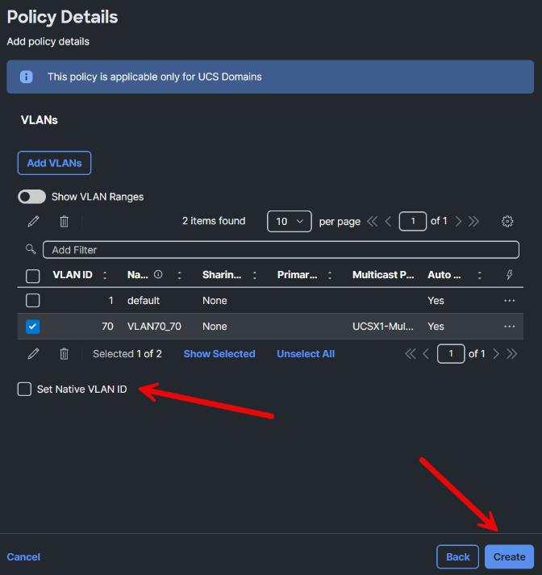
</figure>

For the Fabric Interconnect B we can choose the same VLAN-Policy which we create for Fabric Interconnect A. Click Select Policy for Fabric Interconnect B’s VLAN Configuration select the radio button for the policy you created in the previous step and click Select:

<figure>
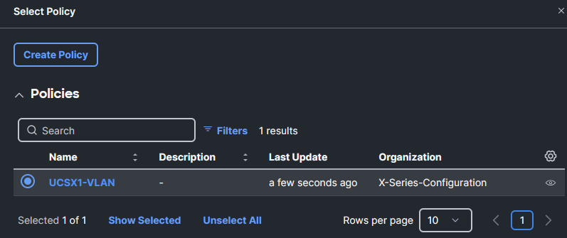
</figure>

## Step 5: Create VSAN

When VSAN is being used, it is normal to have a separate VSAN-A and a VSAN-B.
Because of this, two different VSAN Configuration Policies should be created. For Fabric Interconnect A, click **Select Policy** next to the VSAN configuration as shown below:

<figure>
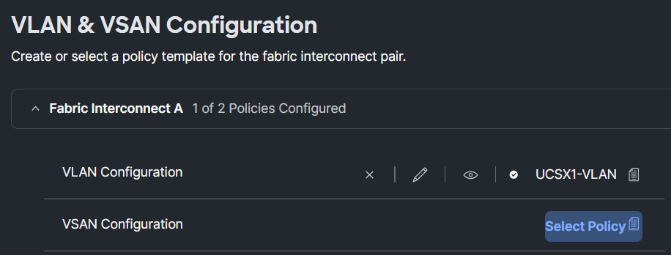
</figure>

Now click **Create Policy** to create a new VSAN Policy and make sure there is a different in the name between VSAN-A and VSAN-B policy. After providing the name and tag information, click **Next**:

<figure>
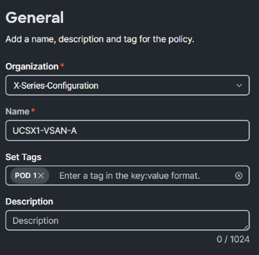
</figure>

Now click **Add VSAN** as shown below:

<figure>
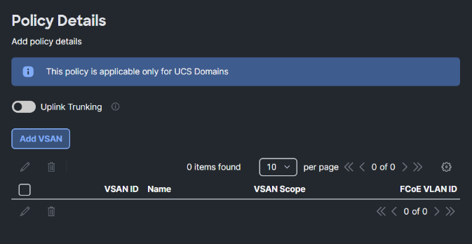
</figure>

In the name field, type **VSAN700,** select **Uplink** as VSAN Scope, type **700** in the VSAN ID field, and use **710** for the FCoE VLAN ID as shown below:

<figure>
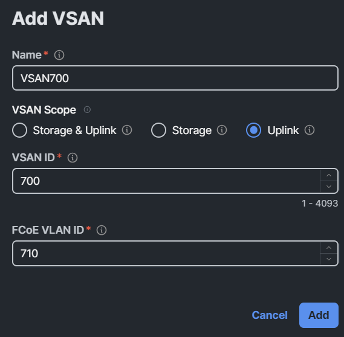
</figure>

Click **Add** to return to the Policy Details screen and then click **Create**.

The next step is the Create a new VSAN Policy for VSAN-B. For Fabric Interconnect B, click **Select Policy** next to the VSAN configuration as we did with Fabric Interconnect A. Now click **Create Policy** to create a new VSAN Policy and use a different name for the VSAN-B policy. After providing the name and tag information, click **Next**. Now click **Add VSAN**; in the name field, type **VSAN701,** select **Uplink** as VSAN Scope, type **701** in the VSAN ID field, and use **711** for the FCoE VLAN ID**.** Click **Add,** then click **Create**. Intersight should now should now see a screen similar to the image below:

<figure>
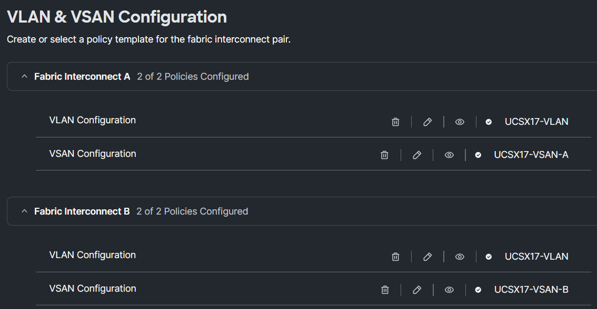
</figure>

Click **Next** to proceed to the Ports Configuration step. Below are several Best Practices to consider for port configurations:

- Plan FC ports ahead.

- Two different Port configurations are needed when using VSAN-A and VSAN-B

- Even if you don’t have FC initial, having two different Port configurations is still better to minimize impact of changes.

- Define the break-out ports in advance.

Step 6: Create two different Port Configuration Policies.

From the Ports Configuration step, click **Select Policy** for Fabric Interconnect A:

<figure>
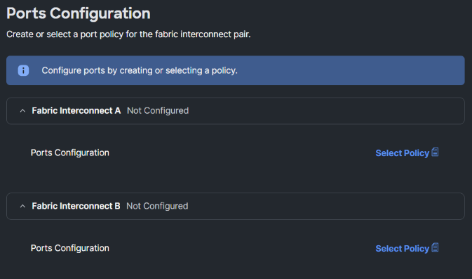
</figure>

Click **Create Policy**:

<figure>
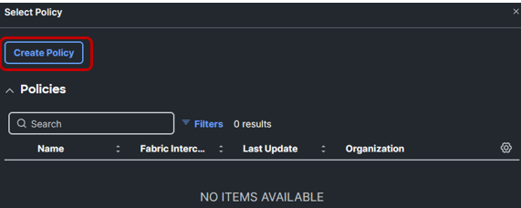
</figure>

Give the policy a name, ensure the FI 6454 is the model selected, provide a tag, then click **Next**:

<figure>
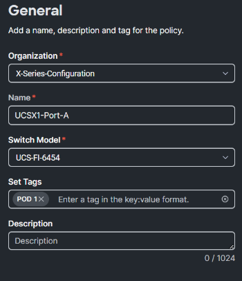
</figure>

This lab environment is not leveraging Fibre Channel but we will configure the first four ports to be FC Ports for demonstration purposes. Under the Unified Ports step, move the slider so that the first four ports on the FI are selected as shown in the image below:

<figure>
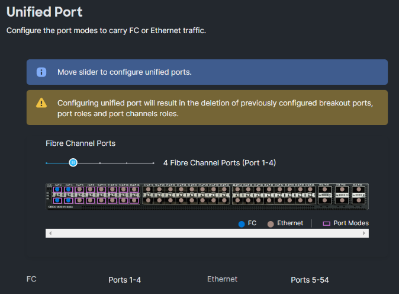
</figure>

Click **Next**

In the next step, you can configure Port 49 as a breakout port, although it is just for practice. Under the Ethernet tab, select port 49 and click **Configure:**

<figure>
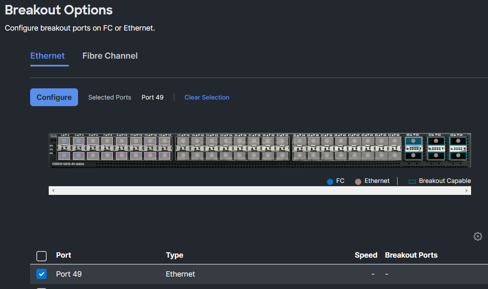
</figure>

On the Set Breakout prompt, select the radio button for **4x25G** and click **Set**:

<figure>
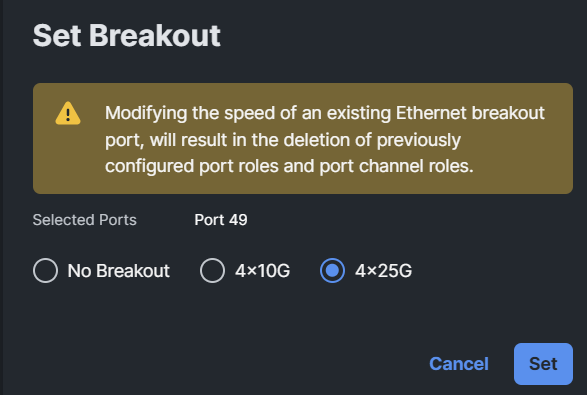
</figure>

Click **Next**.

In the Port Roles step, select ports 5 through 48 and click **Configure**.

<figure>
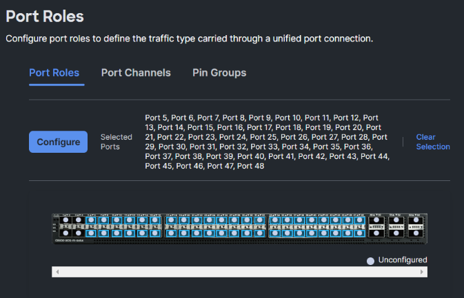
</figure>

Select **Server** from the Role drop down prompt, leave the FEC set to **Auto**, and click **Save**:

<figure>
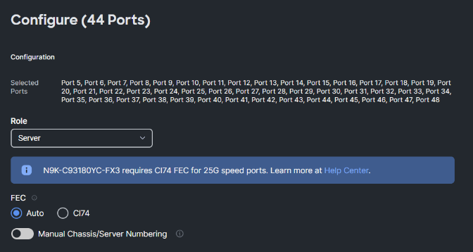
</figure>

From the Port Roles step, select the first four ports and click **Configure**:

<figure>
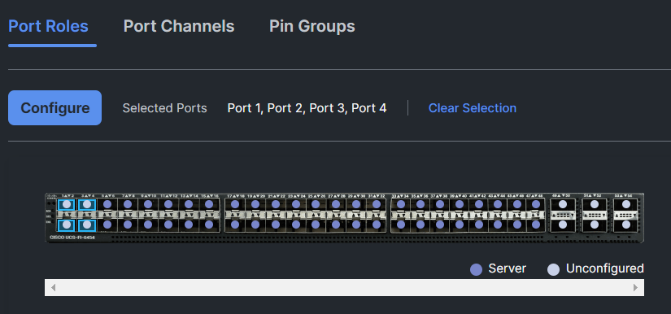
</figure>

Select **FC Uplink** from the Role drop down prompt, Set the Admin Speed to 32Gbps, and click **Save** These ports are FC Uolinks with a speed of 32 Gbps, set the VSAN ID to 700 as we are configuring Fabric Interconnect A, and click **Save**:

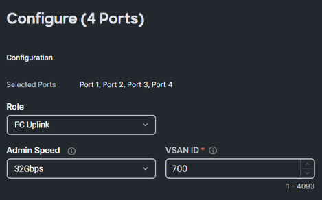

**Best Practices:**

- Always create a port channel, even if there is only one uplink. This way you can easily add more physical connections between the FI and switch.

Select the **Port Channels** tab and click **Create Port Channel**.

<figure>
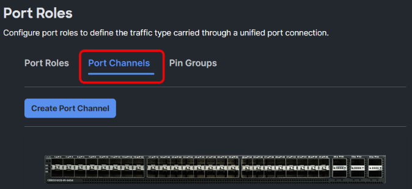
</figure>

**Best Practices:**

- Unless configuring Disjoint Layer 2 or Appliance Uplink Ports – **Do not use the Ethernet Network Group Domain Policy** on the Uplink Ports/Port Channels within the Domain Port Policy. Simply leave this policy selection blank (unselected)

From the Create Port Channel screen, provide a **Port Channel ID**. Best practice is to have this port channel ID the same as on the switch. This makes troubleshooting easier. For now you can use 10 or any other number. Click Select Policy for the Flow Control Policy section and then click **Create Policy**.
<u>Again: Do not use the Ethernet Network Group Domain Policy.</u>

<figure>
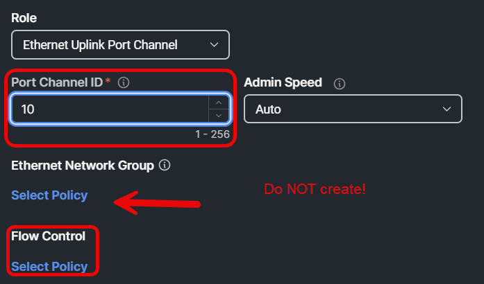
</figure>

Provide a name, set the tag, and click **Next**:

<figure>
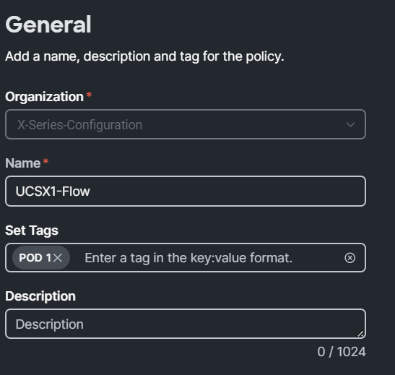
</figure>

**Best Practices:**

- Use **Priority Flow Control (PFC)** when there is a need to have no-drop behavior propagated to upstream LAN/IP-SAN network. Within the UCS server ports, PFC is always on and there is no need of flow control config on these ports (Lossless Behavior)

Ensure the **Auto** radio button is selected and click **Create**:

<figure>
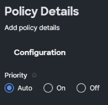
</figure>

This should now be the current policy selected:

<figure>
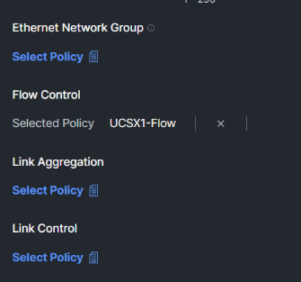
</figure>

Create a new Link Aggregation Policy by clicking Select Policy and then Create Policy when prompted. Provide a name, set the tag, then click **Next**:

<figure>
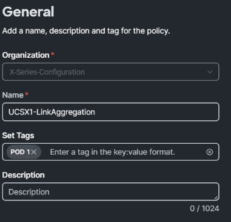
</figure>

**Best Practices:**

- Recommended settings are the default (False/Normal)

- This would direct the FI to NOT suspend Uplink Port-Channel Members and to keep sending PDUs at the Normal Rate…thus allowing the LACP Enabled Upstream Switch to control port suspension based on not receiving LACP PDUs and other error conditions.

- Note: Majority of UCS FI’s are in Ethernet End-Host Mode, and majority of next-hop switches, N9K for example, have default behavior of suspending individual member ports of a port-channel if it does not receive PDUs on that port

Leave the Suspend Individual set to **False** and the LACP rate set to **Normal.** then click **Create**.

<figure>
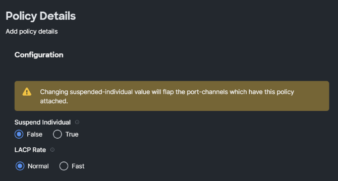
</figure>

Next create a Link Control Policy by selecting **Select Policy** and **Create Policy** when prompted:

<figure>
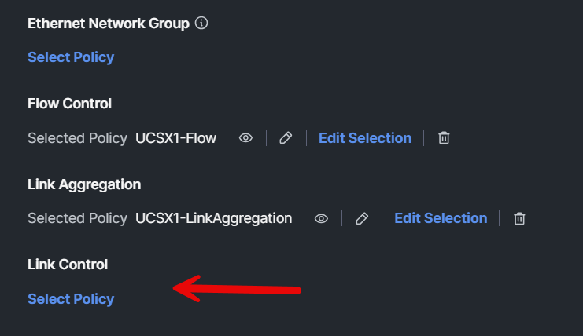
</figure>

Provide a name, set the tag, then click **Next**:

<figure>
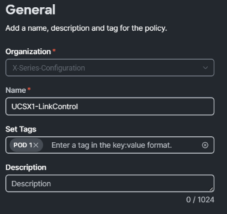
</figure>

**Best Practices:**

- Link Control Policy with UDLD Admin State ‘ON’ should be enabled only when the links on UCS FIs connects to UDLD capable interfaces. Supported interface types are – Ethernet uplink, FCoE uplink, Ethernet uplink port-channel members & FCoE uplink port-channel members. UDLD mode (Normal or Aggressive) settings must be configured the same on both sides of the link.

Leave the configuration as is and click **Create**:

<figure>
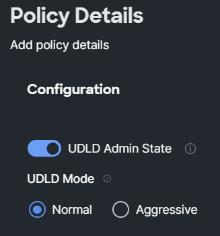
</figure>

From the Create Port screen, select ports **53** and **54** as members of the port-channel and click **Save**.

<figure>
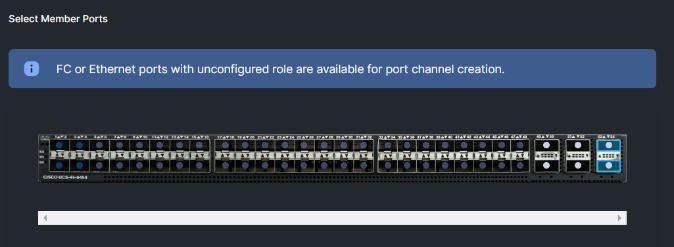
</figure>

Below is an example of how the Port Channel will look when it is configured:

<figure>
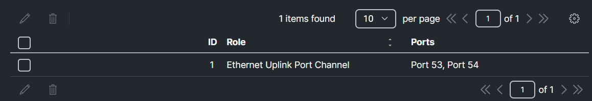
</figure>

Now click **Save**.

Verify the ports and port channels by clicking on it and see if it is correct.

<figure>
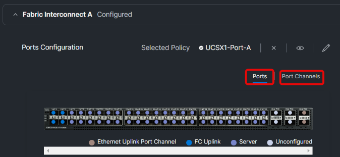
</figure>

Now create a **Port Policy** for Fabric Interconnect B.

In the lab guide, follow the steps performed for creating a Port Policy on Fabric Interconnect A. This is an opportunity to repurpose the Flow Control Policy, Link Aggregation Policy, and Link Control Policy created earlier. When you reach the FC port configuration, use Fabric Interconnect B’s VSAN ID for the first four FC ports instead

:

<figure>
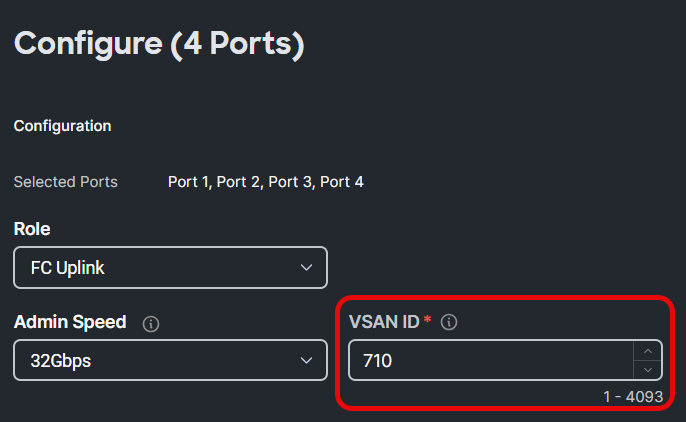
</figure>

This is how is looks when both Fabric Interconnects has the port policy. From here, click **Next**:

<figure>
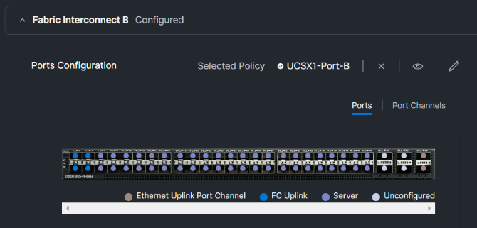
</figure>

We are now going to create the **UCS Domain Configuration** of the **Domain Profile Template**.

<figure>
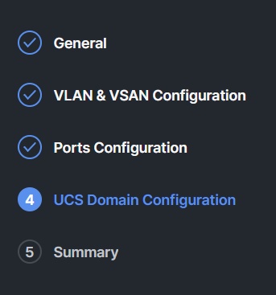
</figure>

There are four Management and two Network Policies:

<figure>
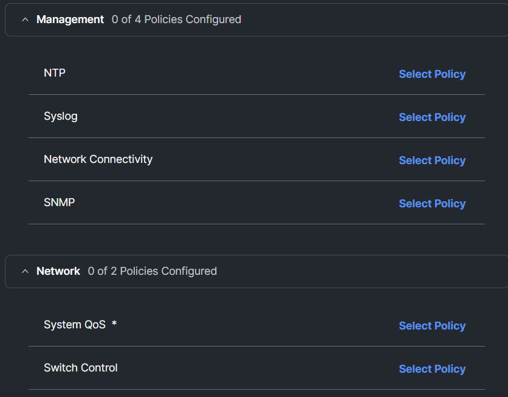
</figure>

Under Management, create the NTP Policy by clicking **Select Policy** next to NTP and then click **Create Policy**. Provide a name, set the tag, and click **Next**:

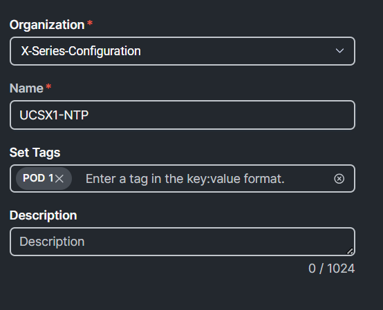

You can create an NTP Policy just for UCS Domain or create one for All Platforms. For this lab, create it under the All Platforms tab. In the NTP Server field, input **172.20.10.10** and select **America/Los_Angeles** as Timezone, then click **Create**:

<figure>
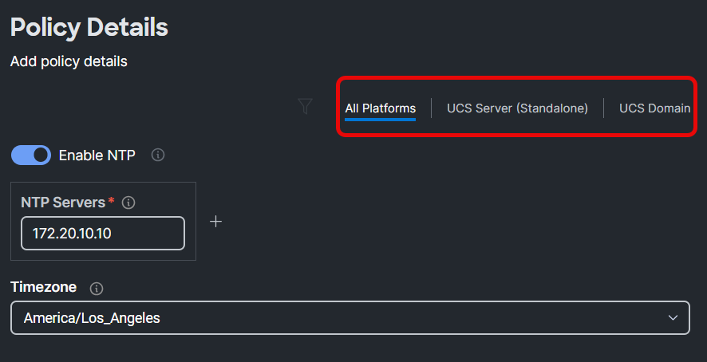
</figure>

Now create a Syslog Policy by clicking **Select Policy** next to Syslog and then click **Create Policy**. Provide a name, set the tag, and click **Next**:

<figure>
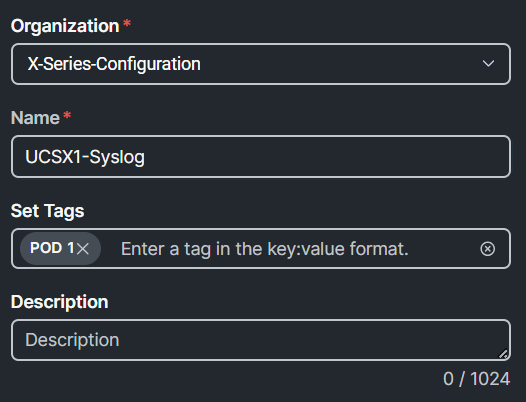
</figure>

Select the **UCS Domain** tab, input **172.20.70.1** in Syslog Server 1’s Hostname/IP Address field, set the Minimum Severity to Report drop down option to **Alert** and then click **Create**:

<figure>
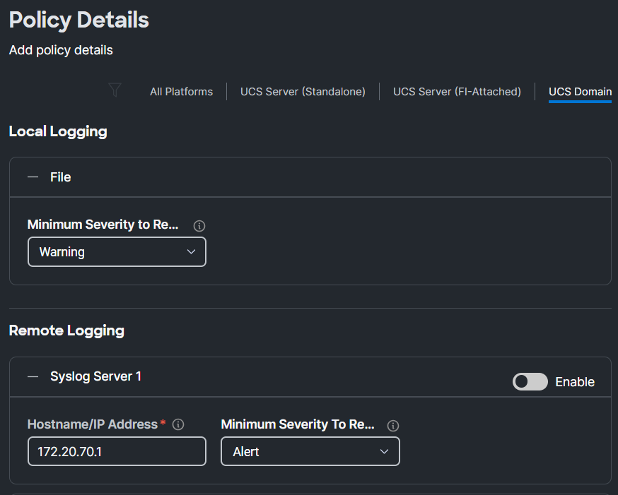
</figure>

Next create the Network Connectivity Policy by clicking **Select Policy** next to Network Connectivity and then click **Create Policy**. Provide a name, set the tag, and click **Next**:

<figure>
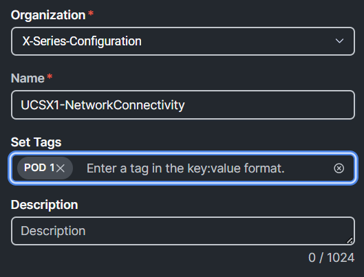
</figure>

Select the **UCS Domain** tab, fill in the DNS Server information as shown in the screenshot below and click **Create**:

<figure>
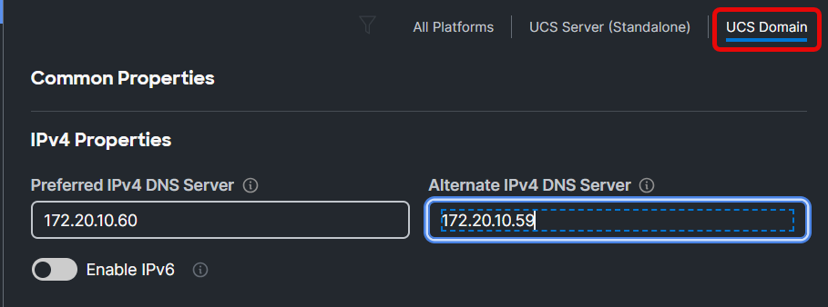
</figure>

Create the SNMP Policy by clicking **Select Policy** next to SNMP and then click **Create Policy**. Provide a name, set the tag, and click **Next**:

<figure>
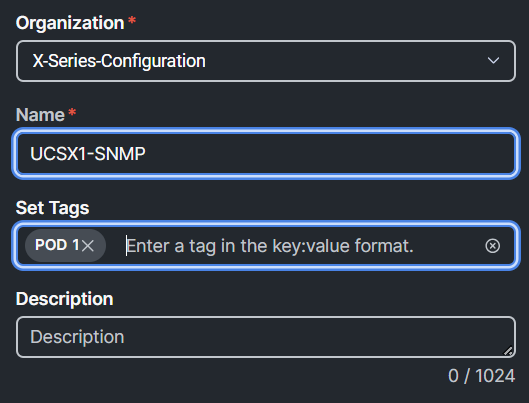
</figure>

Select the **UCS Domain** tab and can fill in the required fields and click **Create:**

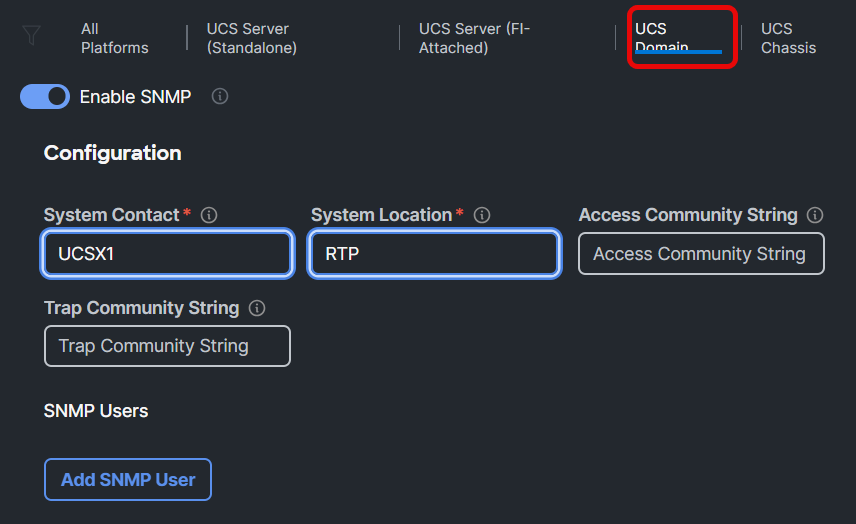

Depending on your situation, you can add SNMP Users, authentication etc.

**Best Practices**

- Consult the administrator for SNMP within your organization and then create the SNMP Policy to match the SNMP Version, SNMP Manager (Trap Destination) and User Account/Password

- Recommend using SNMP v3, Most Secure

- Reference: [Cisco Intersight Managed Mode SNMP Monitoring Guide](https://www.cisco.com/c/en/us/td/docs/unified_computing/Intersight/IMM_SNMP_Monitoring/b_imm_snmp_monitoring_guide/m_overview_snmp_monitoring.html)

Create the System Qos Policy by clicking **Select Policy** next to System QoS and then click **Create Policy**. Provide a name, set the tag, and click **Next**:

<figure>
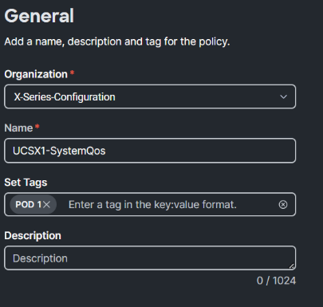
</figure>

In the screenshot below, everything is enabled and as you can see, you can change the parameters if needed. You can enable Jumbo MTU and eventhough the MTU size is 9000, you can set it on the Fabric Interconnect to 9216, because of the overhead of some protocols. Click **Create:**

<figure>
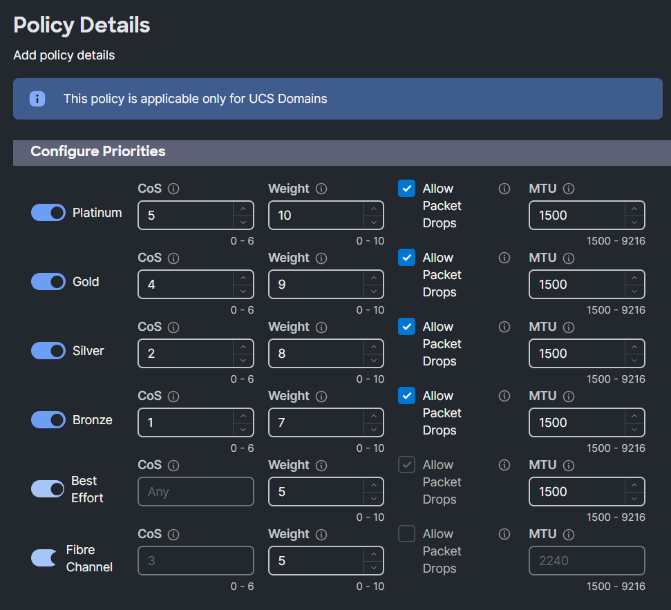
</figure>

Create a new Switch Control Policy by clicking **Select Policy** next to Switch Control and then click **Create Policy**. Provide a name, set the tag, and click **Next**:

<figure>
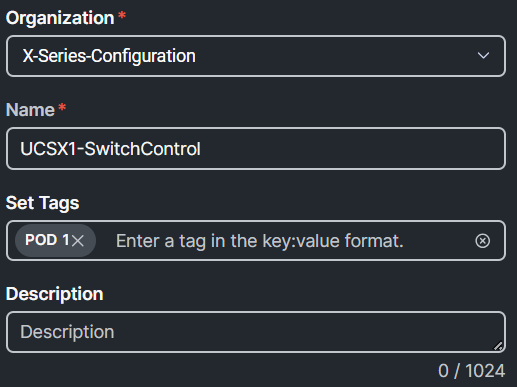
</figure>

Leave the Switching Mode to **End Host** Mode as shown below:

<figure>
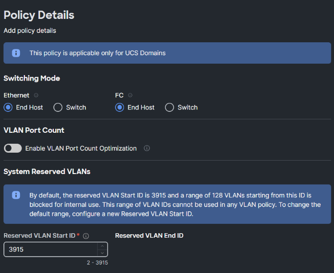
</figure>

If a Fibre Channle connection goes down, a RSCN is sent to the VIC Adapter as shown in this description:

<figure>
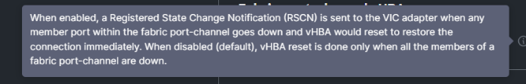
</figure>

Scroll down and toggle the switch to Enable the fabric port-channel vHBA reset as shown below and the click **Create**:

<figure>
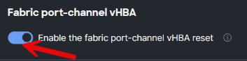
</figure>

Click **Next** to finish the Domain Profile is creation. Now click **Derive Profiles:**

<figure>
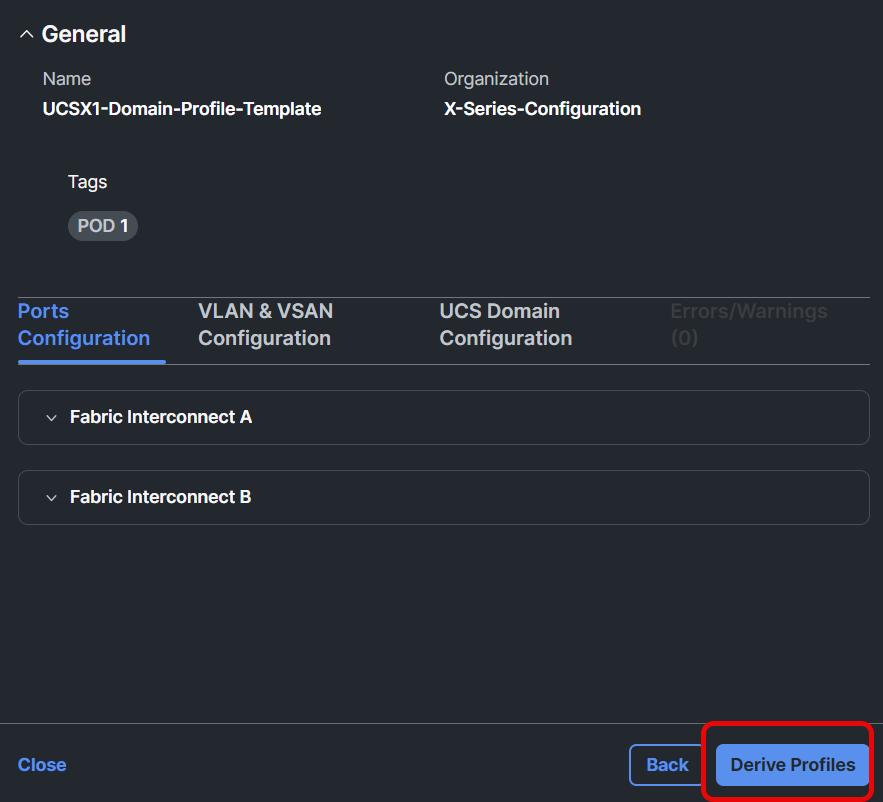
</figure>

Click **Assign Later**, ensure **1** is the number of Profiles to derive, and click Next:

<figure>
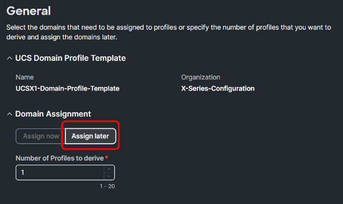
</figure>

Now you can change the name of the profile that will be derived. Make it unique (preferably with your Lab Pod) and click **Next**:

<figure>
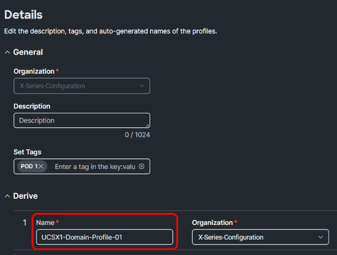
</figure>

Now you are presented with the summary.From this screen, click **Derive**:

<figure>
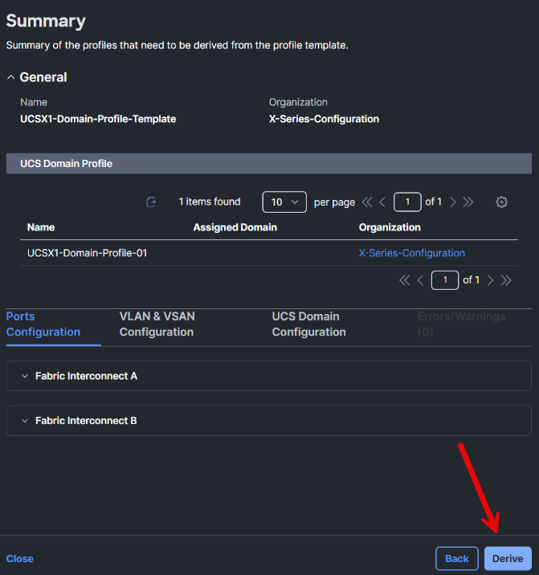
</figure>

To verify if there is a UCS Domain Profile created from the template, go to Profiles (On the left.)

<figure>
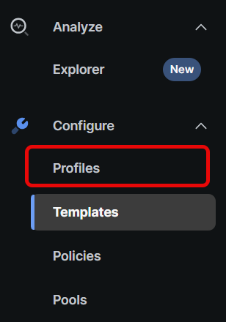
</figure>

Click on the **UCS Domain Profiles** tab and if it was derived correctly, you will see your **Domain Profile**.
**DO NOT ASSIGN THIS PROFILE TO ANY DOMAIN as the lab will be disrupted for 8 participants if assigned.**

<figure>
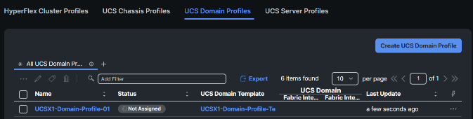
</figure>

There may be other UCS Domain Profiles in the list that were created by the proctors, do not modify any profiles:

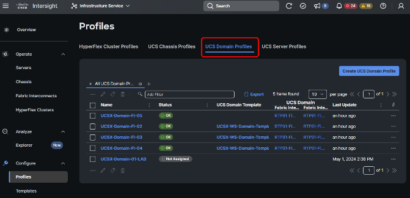
