# Task 3: Create Chassis Policy Template

To create a Chassis Profile Template, Go to **Templates**, **UCS Chassis Profile Template**, and click **Create UCS Chassis Profile Template**:

<figure>
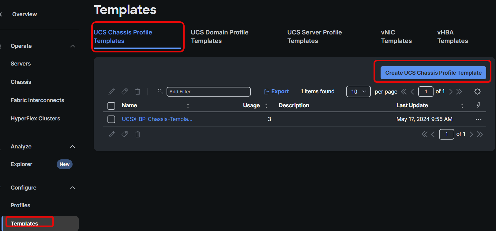
</figure>

Provide a name, set the tag, and click **Next**:

<figure>
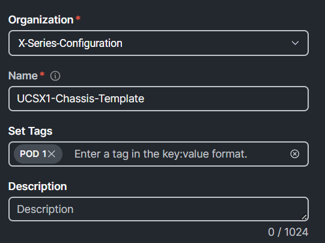
</figure>

Create a new IMC Access Policy by clicking **Select Policy** next to IMC Access and then click **Create Policy**. Provide a name, set the tag, and click **Next**:

<figure>
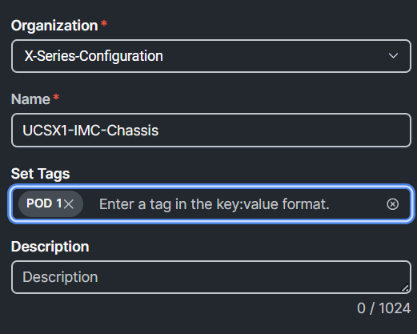
</figure>

Select the **UCS Chassis** tab, change the VLAN ID to **70,** click **Select IP Pool** under IP Pool, select the **UCSXKVMPool** radio button from the list, press **Select**, then press **Create:**

<figure>
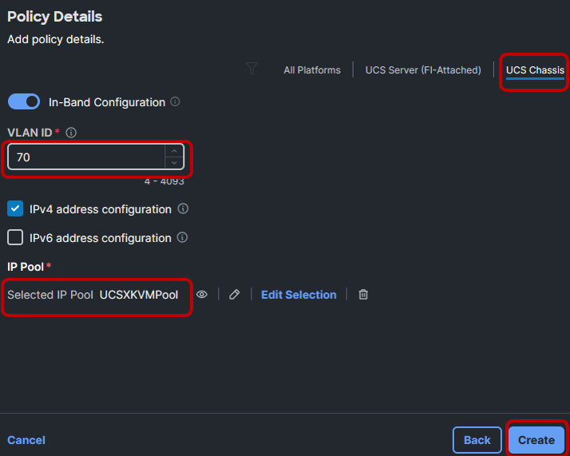
</figure>

**Best practice:**

- Every chassis do need two IP addresses from a pool. Create a separate Chassis-IP-Pool which is non overlapping with other IP Pools

Create a new Power Policy by clicking **Select Policy** next to **Power** and then click **Create Policy**. Provide a name, set the tag, and click **Next**:

<figure>
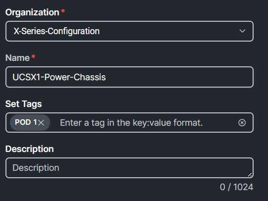
</figure>

Select **UCS Chassis**, ensure **Grid** is selected for the Power Redundancy Policy, and click **Create**:

<figure>
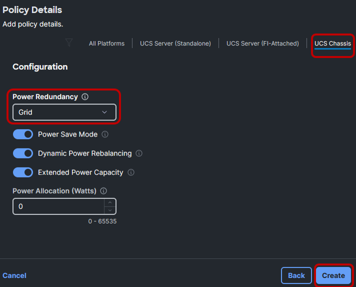
</figure>

**Best Practices**

- Redundancy per customer requirements

- Default options recommended for others

- Dynamic power rebalancing will re-allocate power between servers if competing for power in power constrained environments.

- Power allocation sets an input power limit. Throttling is used to stay within the limit.

Create a new Chassis SNMP Policy by clicking **Select Policy** next to **SNMP** and then click **Create Policy**. Provide a name, set the tag, and click **Next**:

<figure>
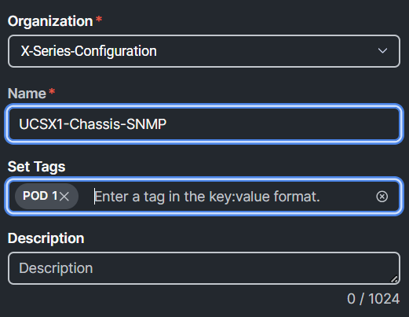
</figure>

Select **UCS Chassis,** type **ACString** in the Access Community String, and click **Create**:

<figure>
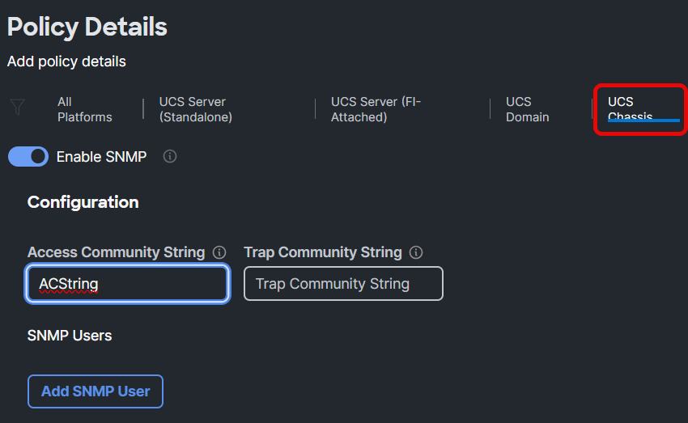
</figure>

Create a new Chassis Thermal Policy by clicking **Select Policy** next to **Thermal** and then click **Create Policy**. Provide a name, set the tag, and click **Next**:

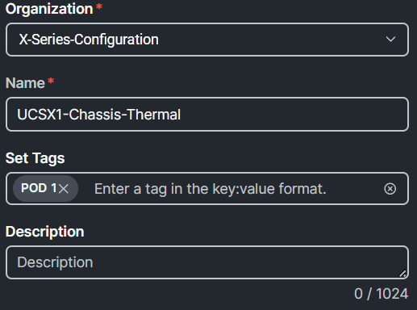.

**Best Practices**

- Applies to chassis or rack mount servers

- Sets the base fan speed

- Workloads with frequent transitions from idle to max may throttle while fan speeds ramp from lower levels.

- Increase policy to prevent throttling.

Select **UCS Chassis,** ensure **Balanced** is selected for the Fan Control Mode, and click **Create**.

<figure>
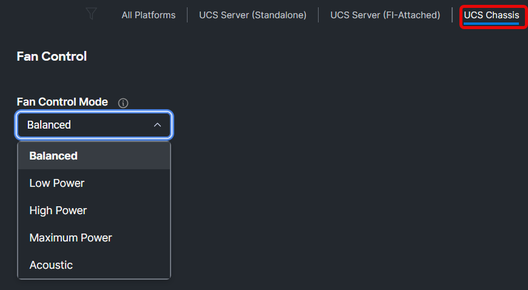
</figure>

After the creation of the policies, the chassis configuration should look similar to the image below. Click **Next** and **Close**. (Do NOT click Derive Profiles):

<figure>
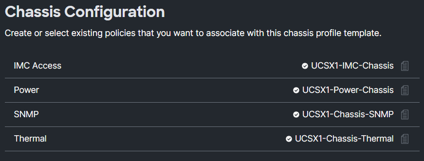
</figure>
