# Task 4: Inventory

When configuring UCS, a domain and chassis policy similar to what was created earlier would be applied, and the systems administrator would start seeing the inventory of the Fabric Interconnects, Chassis and Servers populate in Intersight as they are discovered. We will now review the inventory of devices that have been discovered in Intersight.

First, navigate to **Chassis** and select a chassis from the list:

<figure>
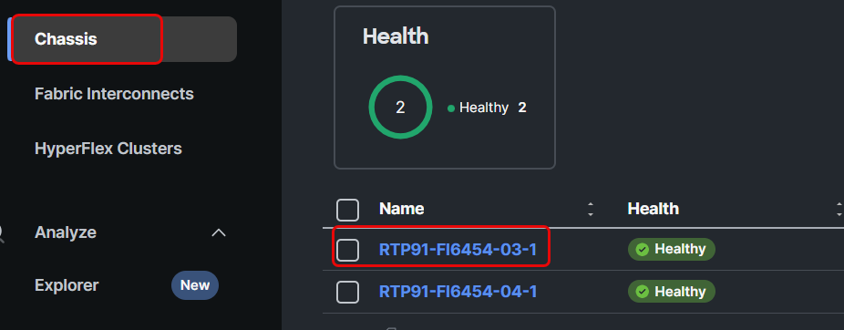
</figure>

The chassis details are now displayed for the chassis you selected in the previous step.

<figure>
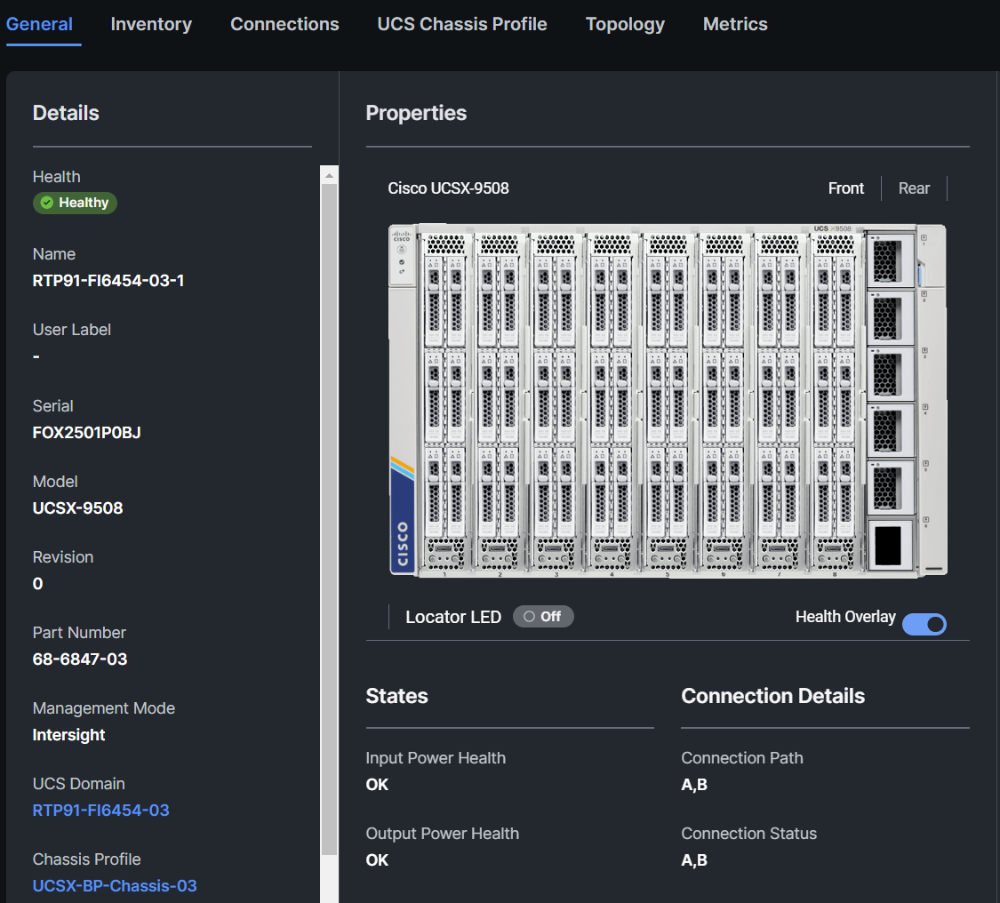
</figure>

In the upper right section of the Properties column, select **Rear** to change the view and see the rear components installed in the chassis:

<figure>
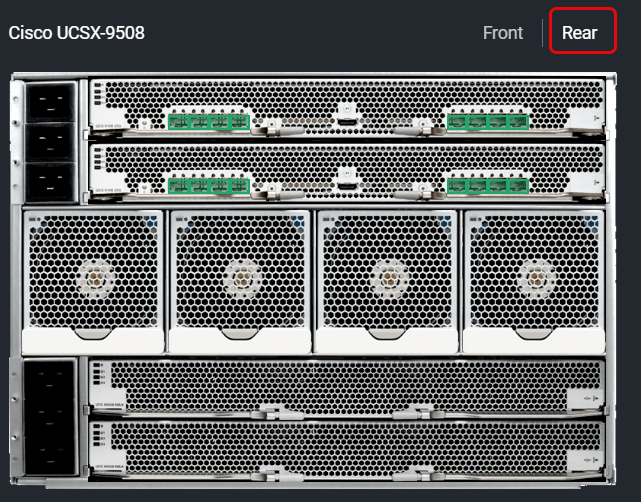
</figure>

Now click on the **Inventory** tab:

<figure>
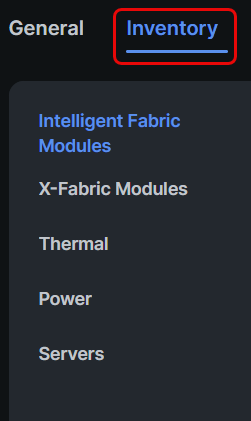
</figure>

Select **Intelligent Fabric Module 1** and review the information under the **General**, **Backplane Ports**, **Fabric Ports**, **Fan Modules** and **Graphic View:**

<figure>
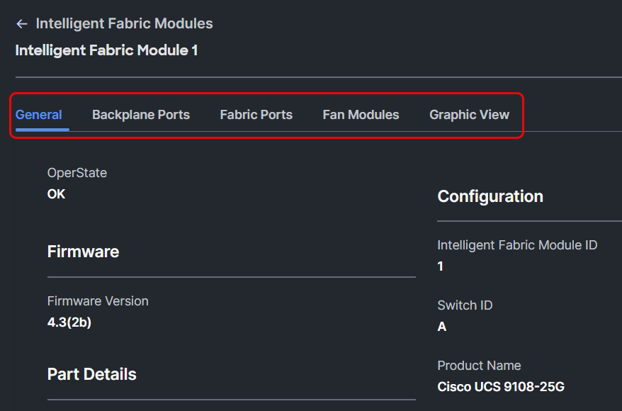
</figure>

There are no X-Fabric Modules installed in the chassis, this can be verified by selecting **X-Fabric Modules** and looking for model **UCSX-9508-RBLK** signifying a blank module is installed in each slot.

<figure>
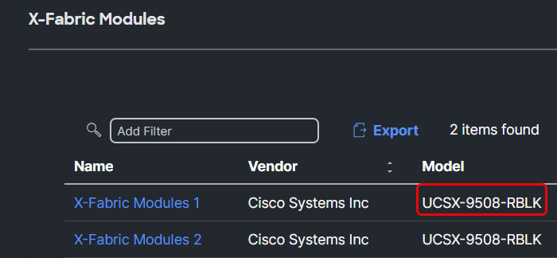
</figure>

The **Thermal** information provides information such as how the Fan Control Mode is configured and the operational state of the Fan Modules:

<figure>
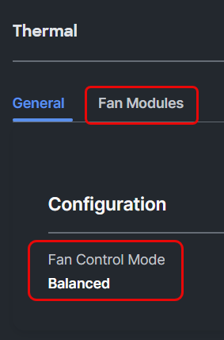
</figure>

Select **Power** to verify the chassis power configuration and how many PSUs are installed.

<figure>
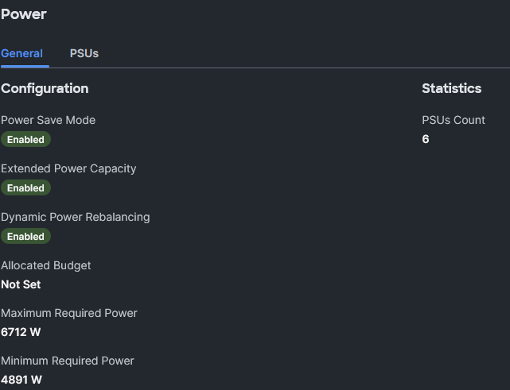
</figure>

Now click **Servers** to display a list of all servers populated in the chassis:

<figure>
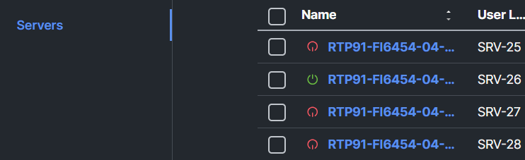
</figure>

Before we proceed to server inventory, select **Servers** and click on your assigned server.

In this example we are going to look at SRV-17 or RTP91-0FI6454-03-1-1:

<figure>
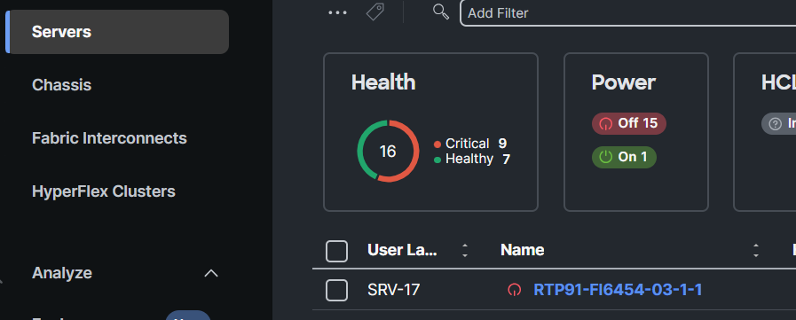
</figure>

At the **General** tab, you will find the server’s serial number, amount of CPUs, Cores, Memory, Adapters, Firmware version, Alarms and much more:

<figure>
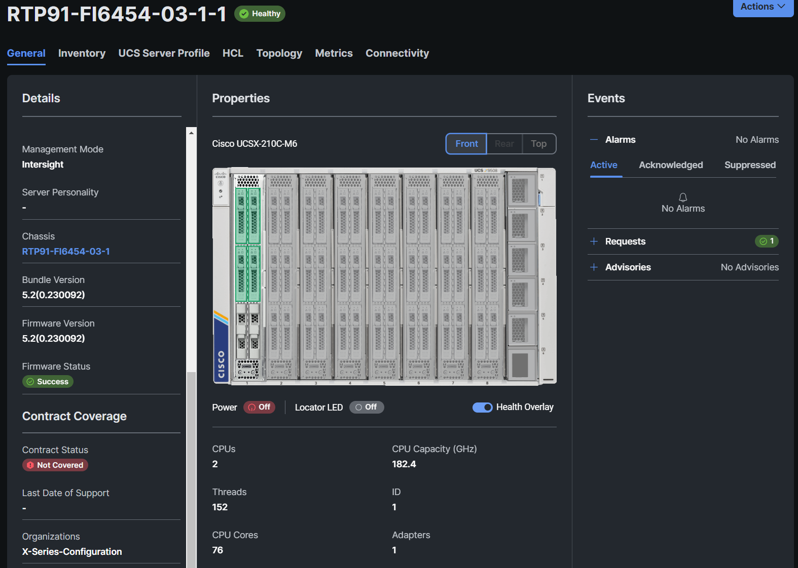
</figure>

In the upper right section of the Properties column, select **Top** to change the view and see the internal components of the server:

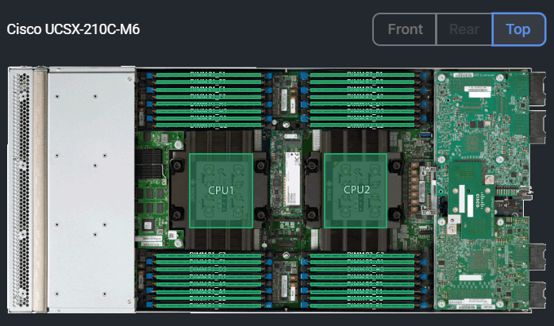

Select the **Inventory** tab and then select **Expand All**.

Walk through the various components and review the hardware installed. Under **Storage Controllers**, verify if the server has a **M.2 Controller.** This will be needed for another task. Verify if the server also has NVMe Drives (**Controller NVME-Direct-U.2 Drives**). If your server has NVMe U.2 drives, document the drive names (i.e. **FRONT-NVME-1** or **FRONT-NVME-2**):

<figure>
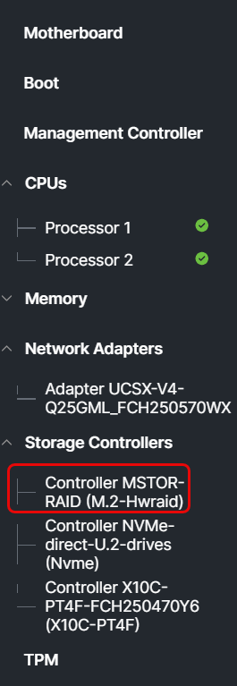
</figure>

Click the **UCS Server Profile** taband verify that there is no Server Profile assigned:

<figure>
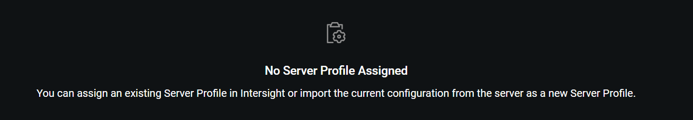
</figure>

Click the **HCL** tab and verify the information displayed in the HCL tab (your HCL may look different than what is displayed below:

<figure>
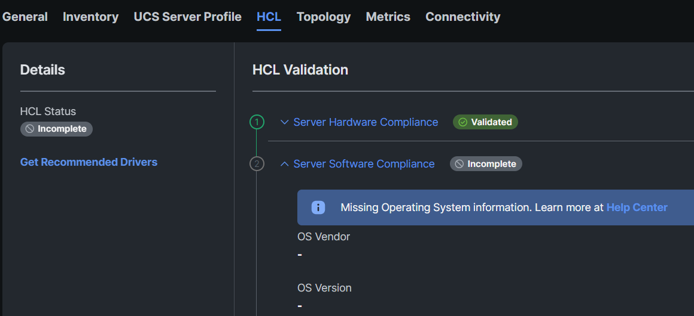
</figure>

Now click the Topology tab to show the connections between the servers, IFMs and Fabric Interconnects:

<figure>
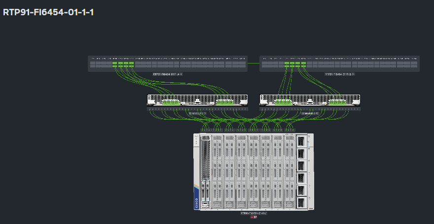
</figure>

Metrics tab information will be reviewed later as there is a task which walks throught the different Metrics in Intersight.

If no server profile is assigned to the server, you should not see any connectivity as shown under the Connectivity tab:

<figure>
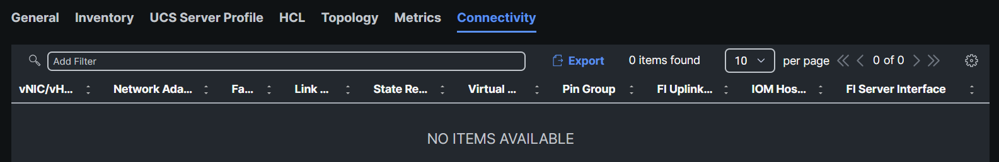
</figure>
