# Task 5: Create Server Profile Template

A server profile contains all the identifiers and settings which makes the server unique. Creating a Server Profile Template allows multiple Server Profiles to be derived from the template and each Server Profile will have the same settings as the template. For example, if the template uses a specific BIOS Policy, then all the derived server profiles will also apply the settings from that BIOS Policy.

The image below is an overview of the policies used in a Server Profile Template:

<figure>
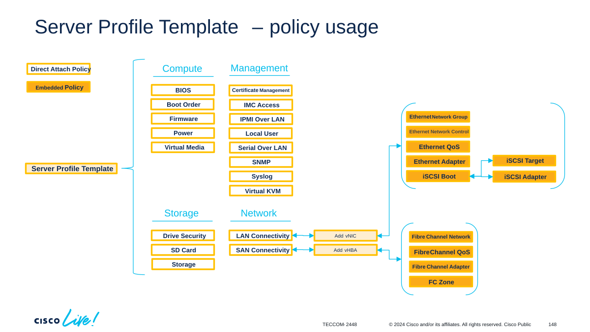
</figure>

Before we begin creating a Server Profile Template, we will create a vNIC template and vHBA template.

## Step 1: vNIC Template

In Intersight select **Templates** under the **Configure** section on the left side of the window. Select the **vNIC Templates** tab and then select **Create vNIC Template:**

<figure>
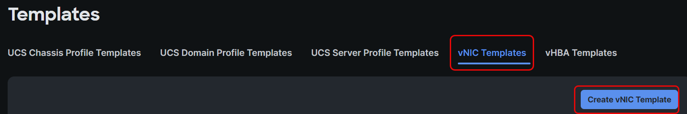
</figure>

Provide a name, set the tag, and click **Next**:

<figure>
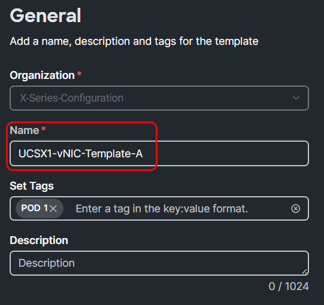
</figure>

Traditionally there may be two or more templates created and the admin might add an “A” or “B” to the name to see over which Fabric Interconnect the traffic will go, for example podX-vNIC-template-A and podX-vNIC-template-B.

Click on **Select Pool** for the MAC Pool, and select create **Create Pool** to create a new MAC Address Pool.

Provide a name, set the tag, and click **Next**:

<figure>
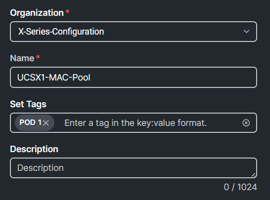
</figure>

Use the prefix of **00:25:B5** for the first three octets, then **your pod number** for the **fourth octet** followed by **zeroes** in this format: 00:25:B5:XX:00:00 (see example below). Set the size to **16** and click **Create**:

<figure>
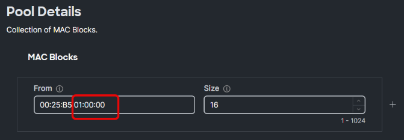
</figure>

This template will be for traffic that is going over Fabric Interconnect A. Ensure Switch ID is set to **A**.

If the Switch ID is B, the traffic is going over Fabric Interconnect B.

An available option is to allow the UCS Hardware to do the failover of the vNIC traffic between Fabrics A and B. Failover in the hardware can have advantages, but for many solutions we create two vNICs so the OS will have two interfaces with each going over one side of the UCS fabric.

Ensure Failover is **Enabled** (This will save time in the lab by not having to create another vNIC template for the other Fabric Interconnect):

<figure>
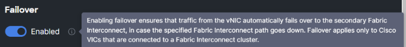
</figure>

When Failover is enabled we create only one vNIC and the OS only sees one interface. When there is a failover of the Fabric Interconnect, the traffic will switch to the other Fabric Interconnect and the OS won’t know about this event.

Now click **Select Policies** for the **Ethernet Network Group**, select **Create Policy**, provide a name, set the tag, and click **Next**:

<figure>
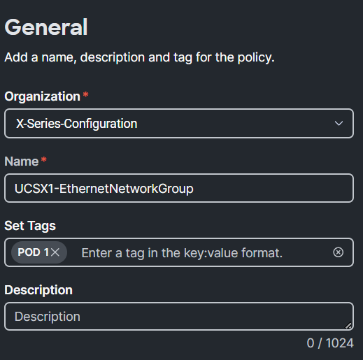
</figure>

**Best Practices:**

- Populate with required VLANs. Consider using multiple Policies to coincide with specific use-cases of the intended vNIC.

- In Most cases, you would want to use the same Ethernet Network Group Policy for vNICs assigned to both A and B Fabrics. For HA Failover purposes, you want the same VLANs to be able to be passed from both Fabrics.

- Keep the default settings. Change it only if needed.

Click the **Add VLANs** drop-down box, select **Enter Manually**, enter VLAN **70** and select **Enter**. Under the VLAN ID table, select the actions button for **VLAN** **70**,select **Set Native VLAN,** then click **Create:**

<figure>
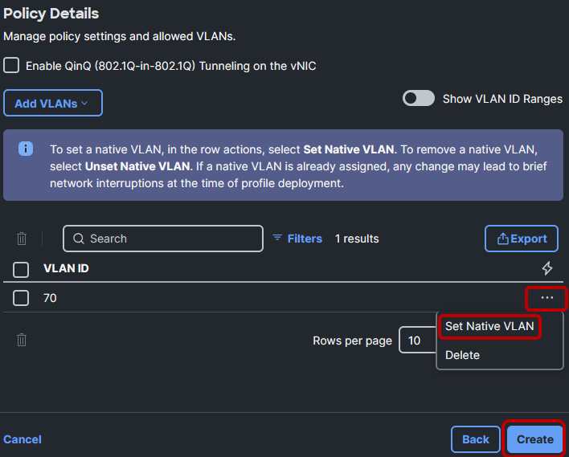
</figure>

Fromthe **Select Policies** screen, choose the policy you just created and click **Select**.

Click **Select Policies** for **Ethernet Network Control**, select **Create Policy**, provide a name, set the tag, and click **Next**:

<figure>
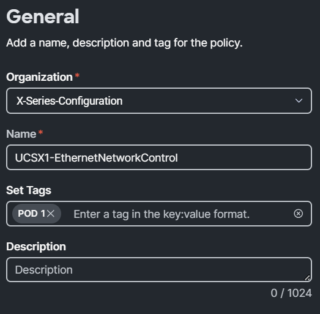
</figure>

Toggle the **Enable CDP** switch to enable CDP, toggle the **Enable Transmit** switch under **LLDP** as shown below, then click **Create**:

<figure>
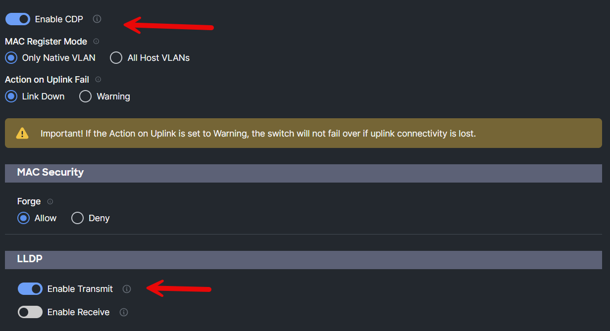
</figure>

Click **Select Policy** for **Ethernet QoS**, select **Create Policy**, provide a name, set the tag, and click **Next**:

<figure>
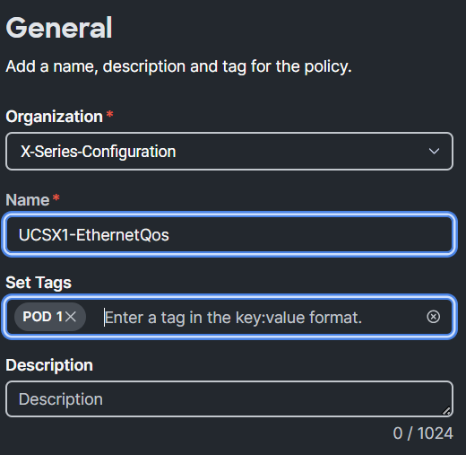
</figure>

Select the **UCS Server (FI-Attached)** tab, ensure MTU, Bytes is **1500** and select **Create**:

<figure>
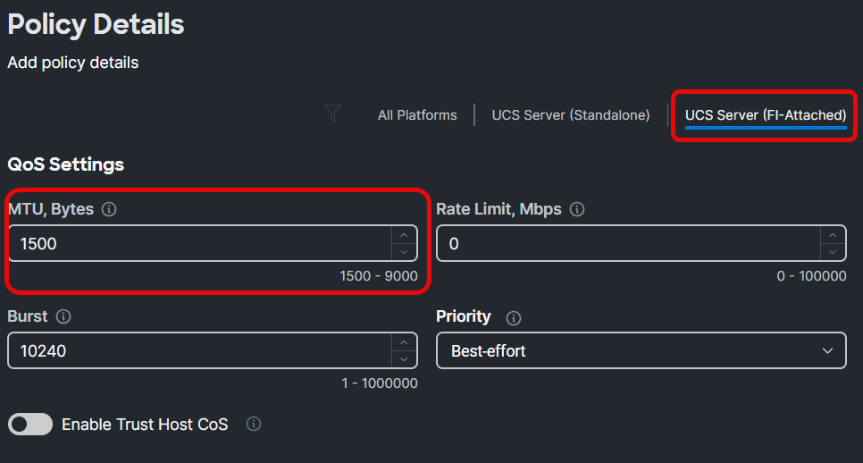
</figure>

**Best Practices:**

- In the absence of any specific guidance or use-case, use default settings.

- Keep in mind that with UCS the Ethernet QoS Policies are only enforced if there’s congestion sensed on the port. Otherwise, all the queues are available for existing traffic

- Simple Use Case Example: Video Streaming Packets (WebEx as example) would likely need a higher priority traffic flow than email traffic.

- If you are using Jumbo MTU (Size 9000), you will have to configure it end to end and here you can change it for the vNIC.

Click **Select Policy** for **Ethernet Adapter**, select **Create Policy**, provide a name, set the tag, and click **Select Default Configuration**:

<figure>
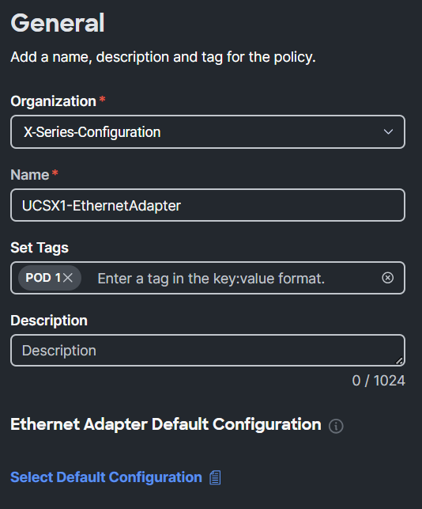
</figure>

Under Select Cisco Provided Configuration, click on the eye next to Linux as shown below to see the policy details:

<figure>
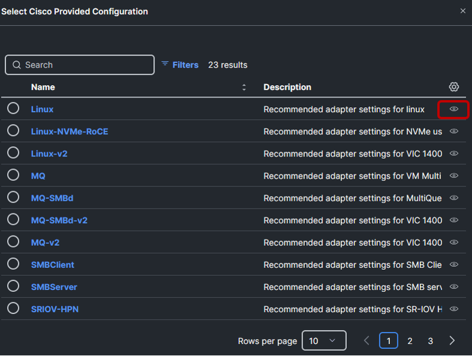
</figure>

Close the pop-up window by clicking the **X** next to **View Linux**, select the radio button next to **Linux**, then click **Select**:

<figure>
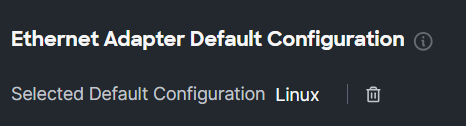
</figure>

**Best Practices:**

- Since the Default Settings have been pre-configured for a given OS-type and/or Workload Use-Case, certainly you want to adopt the correct default settings for optimal network performance of the server.

- If you are going to change a setting from the default settings, highly recommend you do so in-accordance with either a vender supplied paper or Cisco Validated Design (CVD) document. Experimenting with different settings should be vetted in a Lab Environment before introducing those settings to a Production Environment.

Click **Next**

Select **UCS Server (FI-Attached)**, leave all the settings default, and click **Create**:

Walk through the settings and see if there are features, like PTP that can be useful for your environment.

<figure>
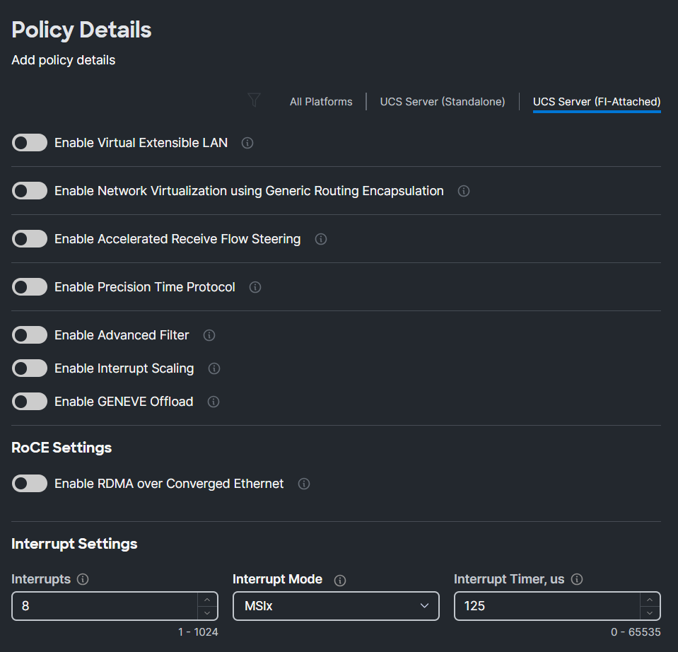
</figure>

There are different features of the vNIC such as usNIC, VMQ and SR-IOV. Leave the **Connection** set to **Disabled** and click **Create**.

Now we have created one vNIC template. Because the Failover is enabled, we are not going to create another vNIC template where the traffic is going over Fabric Interconnect B. In certain production environments you will have to do this in order to divide traffic across the A and B side fabrics.

## Step 2: vHBA Template

Now click the **vHBA Templates** and click on **Create vHBA Template**:

<figure>
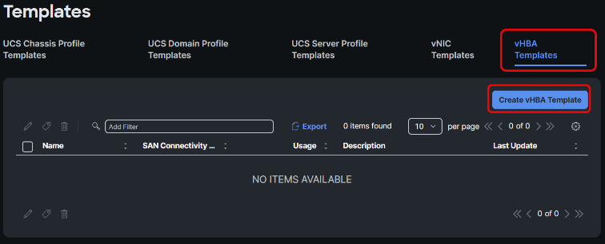
</figure>

Give the template a unique name with -A at the end as we are configuring a vHBA template for the A-Fabric, set the tag, and click next:

<figure>
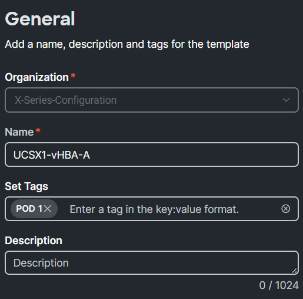
</figure>

Click **Select Pool** under the **WWPN Pool** section, click **Create Pool**, give the pool a unique name, set the tag, and click **Next**:

<figure>
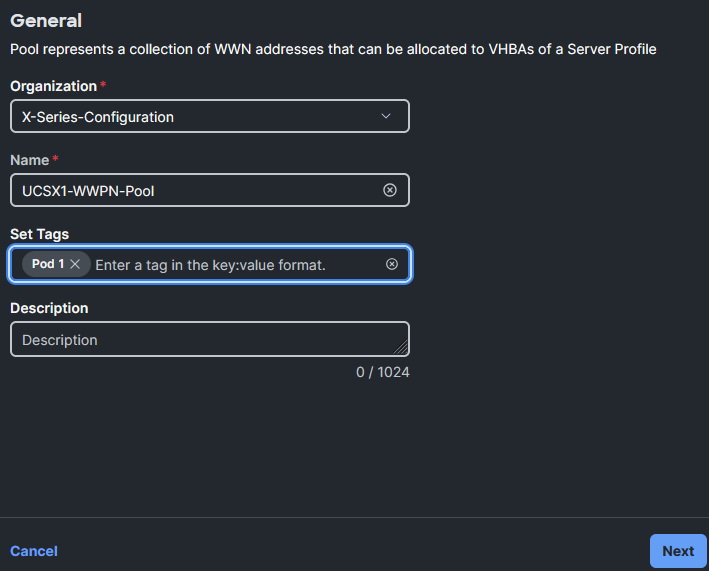
</figure>

In the From field, enter your POD number plus 00:00 for the last two octets (i.e. 20:00:00:25:B5:01:00:00). Set the Size to **16** then click **Create**:

<figure>
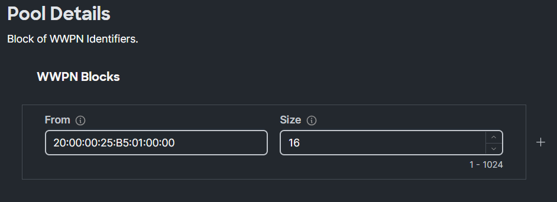
</figure>

Back in the vHBA Template, select the correct Switch ID (A for VSAN-A and later on B for VSAN-B):

<figure>
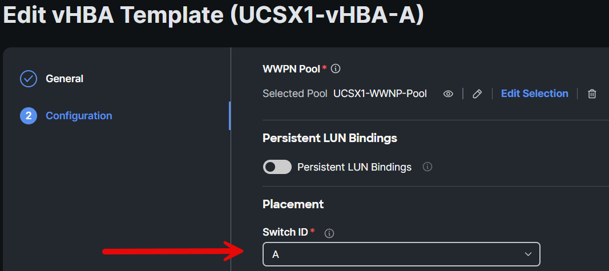
</figure>

Click **Select Policy** under **Fibre Channel Network**, click **Create Policy**, provide a name, set the tag, and click **Next** (for vHBA-A Template, create a new Fibre Channel Network Policy with VLAN 700):

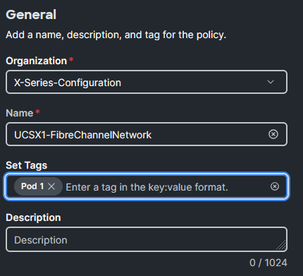

Select **UCS Server (FI-Attached)**, fill in the VSAN ID (**700** for vHBA-A. **701** for vHBA-B), and select **Create**:

<figure>
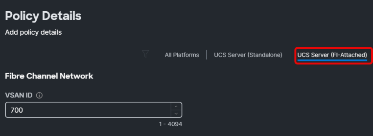
</figure>

Click **Select Policy** under **Fibre Channel QoS**, click **Create Policy**, provide a name, set the tag, and click **Next**:

<figure>
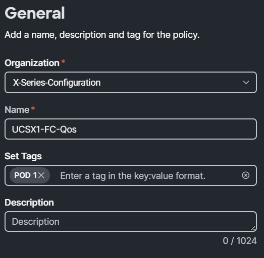
</figure>

Select **UCS Server (FI-Attched)** and click **Create**:

<figure>
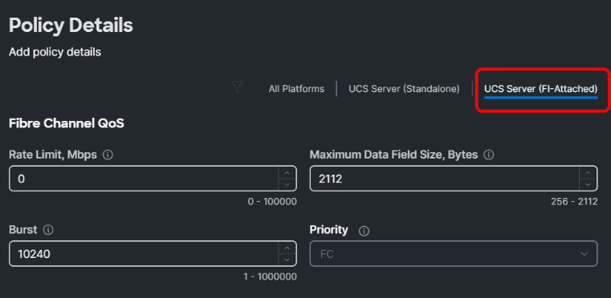
</figure>

Click **Select Policy** under **Fibre Channel Adapter**, click **Create Policy**, provide a name, set the tag, and click **Select Default Configuration**, choose **Linux**, click **Select**, click **Next**, then click **Create**:

<figure>
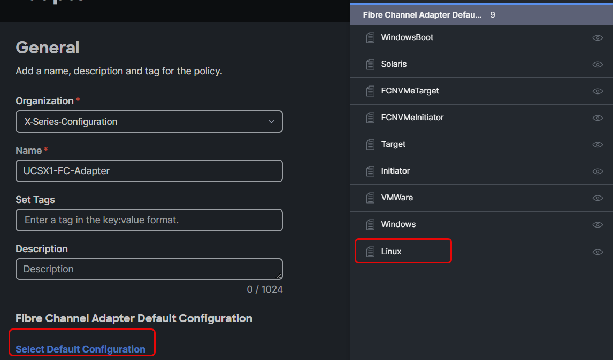
</figure>

> **Note:** If the Fabric Interconnect is in FC Switch Mode you have to configure the FC Zones because FC zoning would be handled by the FIs. Most common is to leave the Fabric Interconnect in the default FC End-host mode and the FC zones will be configured on the upstream FC switches such as Cisco MDS.

Click **Create** to finalize the creation of the vHBA template for VSAN-A. Now return to the step when vHBA Template A was created and follow the same steps to create a template for VSAN-B. Be sure to select **switch ID B** for the placement and when you create the create the **Fibre Channel Network Policy** to change the **VSAN ID** to **701**. Once the second template has been created, you will now see two vHBA Templates as shown below:

<figure>
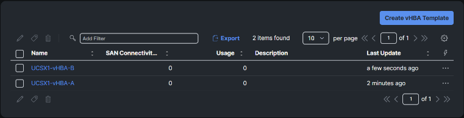
</figure>

## Step 3: UCS Server Profile Template

Under **Templates**, select **UCS Server Profile Templates** and click on **Create UCS Server Profile Template**.

Provide a name, select the radio button next to **UCS Server (FI-Attached)**, set the tag, and click **Next:**

<figure>
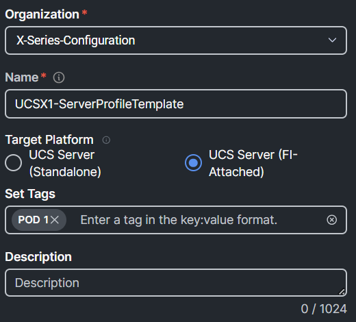
</figure>

Now we have to create different types of Policies. Click on **Select Pool** under **UUID Pool** to create a new UUID Pool Policy.

<figure>
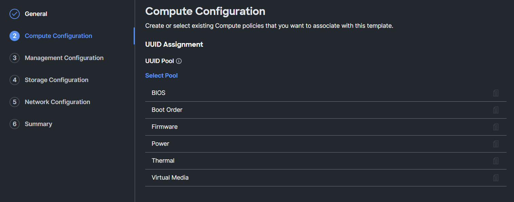
</figure>

Now click **Create Pool** under **Select Pool.** A UUID is a unique identifier for the server. Provide a name, set the tags, and click **Next**:

<figure>
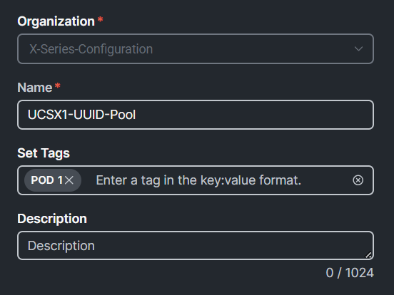
</figure>

Fill in the **Prefix** with a unique sequence (you can start with your pod number), provide the starting UUID suffix in the field under **UUID Blocks**, make the size of the UUID pool **16**, and then click **Create**:

<figure>
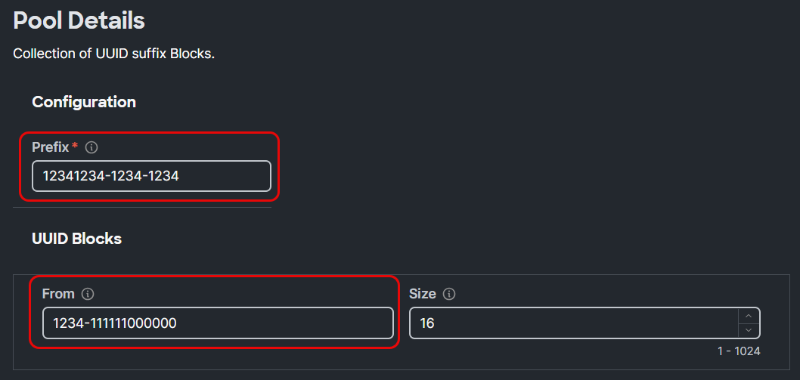
</figure>

Click **Select Policy** next to **BIOS**, click **Create Policy**, provide a name, set the tag, and click **Next**:

<figure>
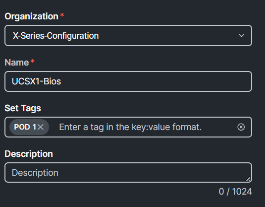
</figure>

Make sure UCS Server (FI-Attached) is selected *(Note: Any changes to this policy in the future will require a reboot of the server to take effect.)*

<figure>
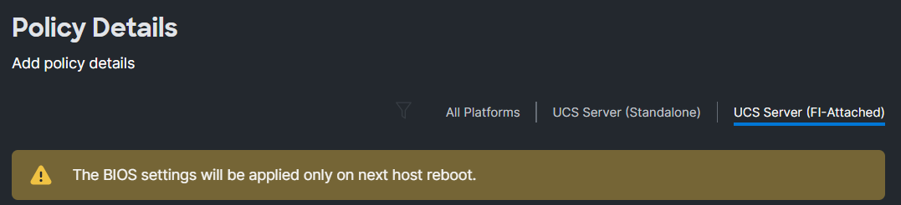
</figure>

**BIOS Recommendations:**

- To have more information about the default settings and what is means, read Cisco UCS Server BIOS Tokens in Intersight Managed Mode:

<https://www.cisco.com/c/en/us/td/docs/unified_computing/ucs/Intersight/IMM_BIOS_Tokens_Guide/b_IMM_Server_BIOS_Tokens_Guide/b_UCS_BIOS_Tokens_Guide_chapter_01.html>

- For High Performance BIOS settings read Performance Tuning Best Practices Guide for Cisco UCS M7 Platforms:

<https://www.cisco.com/c/en/us/products/collateral/servers-unified-computing/ucs-b-series-blade-servers/ucs-m7-platforms-wp.html#CiscoUCSBIOSoptions>

Take some time to expand and review various settings that can be applied to UCS servers. For now, we won’t make any modifications leaving everything to their **platform-default** state and proceed by clicking **Create**.

Now click **Select Policy** next to **Boot Order**, click **Create Policy**, provide a name, set the tag, and click **Next**:

<figure>
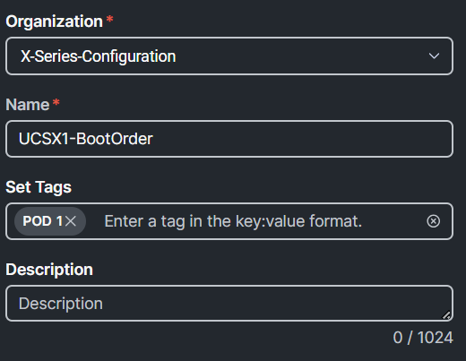
</figure>

There are many possibilities for booting UCS servers. For this lab, we will be adding three methods (some servers in the lab have NVMe drives which can be booted from instead of M.2 drives).

Ensure **UCS Server (FI-Attached)** is selected and toggle **Enable Secure Boot**. UEFI will be default when selecting this option.

Click on **Add Boot Device** and select **Virtual Media**. Type **vMedia** in the **Device Name** field and leave the Sub-Type **None**.

Now add a second boot device by clicking on **Add Boot Device**, select **Local Disk**, type **Local** in the **Device Name**, and type **MSTOR-RAID** in the **Slot** field. *(Note: storage slot information can be found in the inventory of the server under **Storage Controllers** if needed).* Leave the remaining input fields empty.

In **Task 4**, you were asked to document f your server has NVMe drives. If it does, click Add Boot Device, Select **NVMe**, type **FRONT-NVME-1** in the **Device Name** field. Clcik the up arrow for the the **Virtual Media** to ensure it is at the top of the list after creating the boot options and then click **Create**:

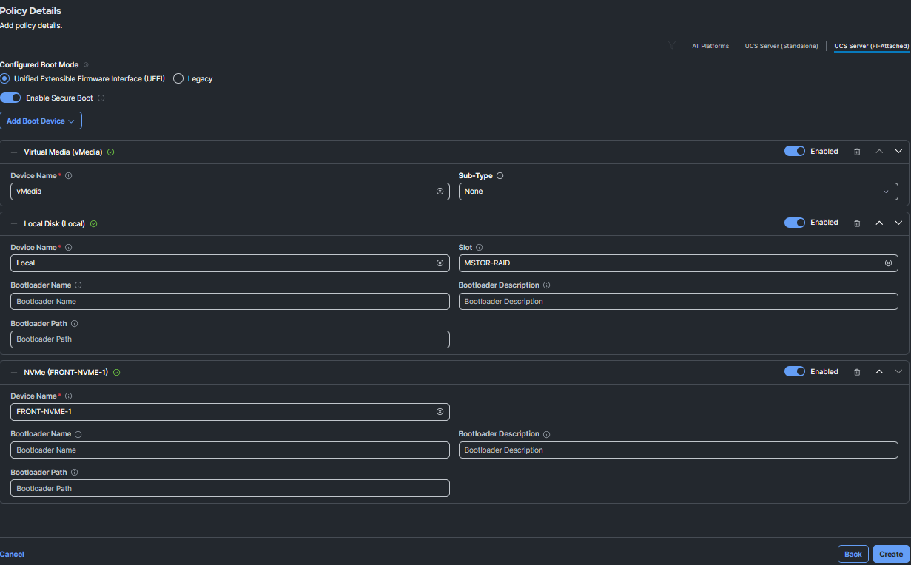

<figure>
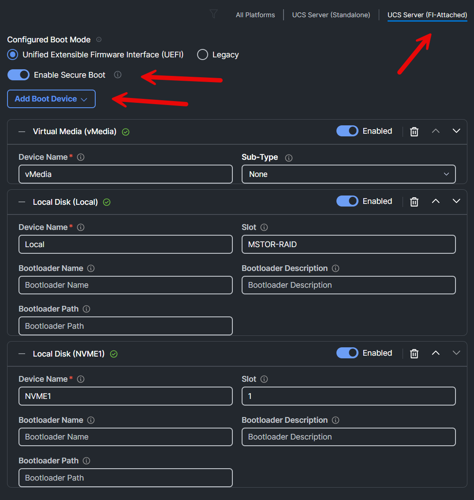
</figure>

**NEW: PCIe Connectivity Policy**

We will skip the **Firmware Policy** and **Memory Policy** for this lab but will create a PCIe Connectivity Policy showing the process to configure a policy to leverage GPUs and SmartNICs that would be hosted in the X580p PCIe node and X9516 XFM.
Next to **PCIe Connectivity**, click **Select Policy**.
From the Select PCIe Connectivity menu, click **Create Policy**.
Ensure the organization is correct for the lab and give the policy a unique name, set the tag, and click **Next**.

From the Policy Details section, change the first ID to **1**, change the quantity to **2**, and select **UCSC-GPU-RTXP6000** from the GPU model.
Now toggle the selection to enable the SmartNIC allocation and select **UCSC-P-N7S400GFO** from the dropdown menu.
Once this is done, click **Add Mapping** which will expand a second selection.
Given you can’t mix GPU models in the same host, there is no selection for the user to select a different GPU model.
Toggle the selection to enable the SmartNIC allocation for the second CPU and verify the **UCSC-P-N7S400GFO** SmartNIC is already selected in the dropdown menu.
Once completed, your selections should be similar to the figure below.
If so, select **Cancel**, select **Leave** when prompted, and then **Cancel** on the **Select PCIe Connectivity menu** as we **do not** have any PCIe nodes/X9516s available in the lab chassis leveraged for this lab:

<figure>
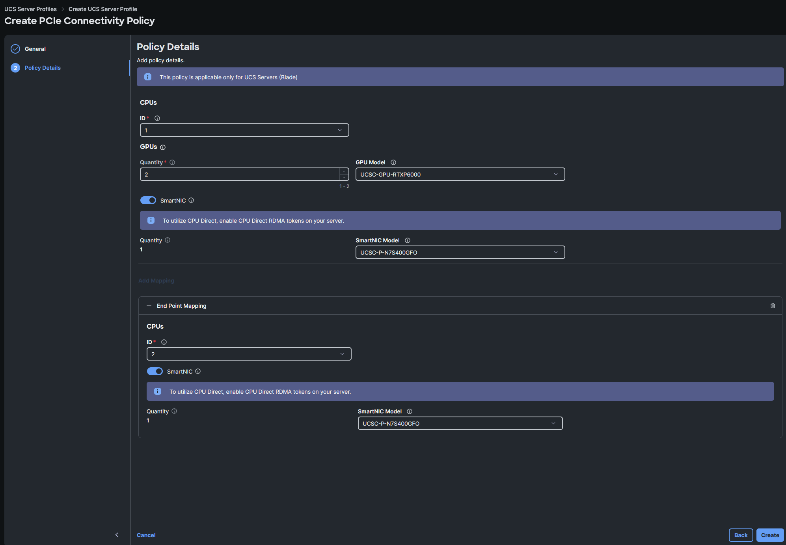
</figure>

Now click **Select Policy** next to **Power**, click **Create Policy**, provide a name, set the tag, and click **Next**:

<figure>
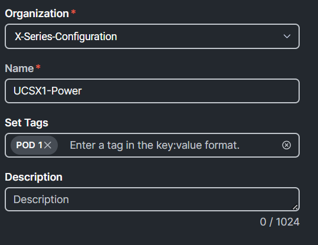
</figure>

Ensure the **UCS Server (FI-Attached)** tab is selected, ensure the **Power Profiling** slider is enabled
(note: this option is only for UCS X-Series servers and allows the power manager to run power profiling utility to determine the power needs of the server), set the **Power Priority** to **Medium**, set **Power Restore** to **Last State**, leave the **PPL** state **default**, and click **Create**:

<figure>
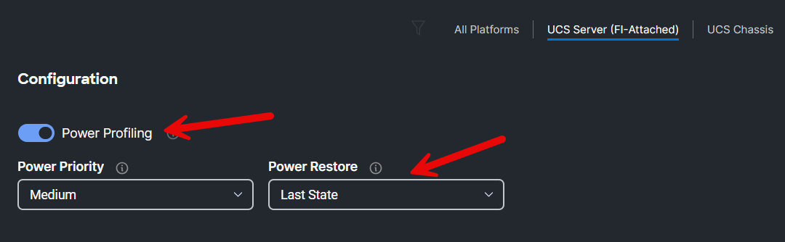
</figure>

**Best Practices**

- Recommend profiling on all servers. **PCIe node included** with server.

- Highest priority servers are allocated any power available above minimum.

- Once higher priority servers have their max allocation, lower priority servers are allocated what is left.

- Power restore refers to chassis power restoration. Last State is the recommended setting.

**The Scrub Policy settings will be skipped in this lab.**

Click **Select Policy** next to **Virtual Media**, click **Create Policy**, provide a name, set the tag, and click **Next**:

<figure>
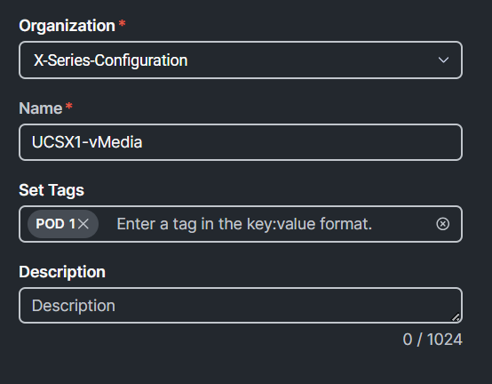
</figure>

Ensure the **UCS Server (FI-Attached)** tab is selected and verify all three settings (**Enable Virtual Media, Enable Virtual Media Encryption** and **Enable Low Power USB)** are enabled (don’t add **Virtual Media** to the policy), and click **Create:**

<figure>
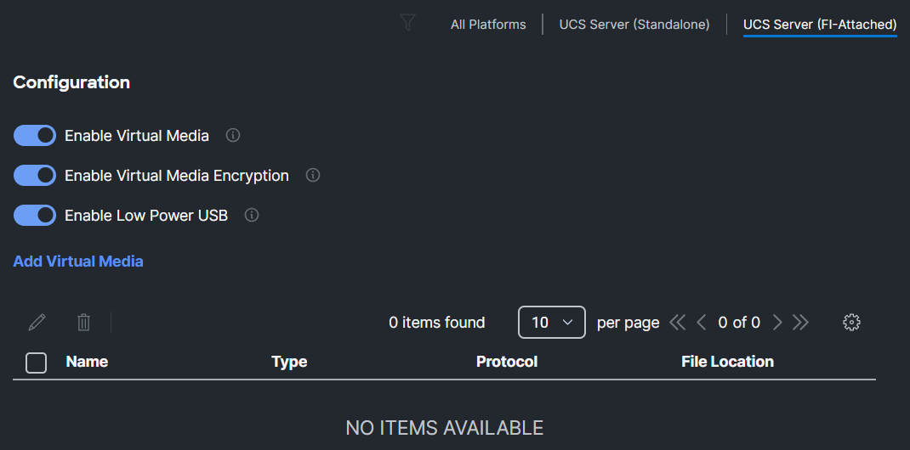
</figure>

Now, proceed to the **Management Configuration** of the Server Profile Template by clicking **Next**.

We are not going to configure Certificate Management, IPMI over LAN, Local User, Serial Over LAN.

Local User is needed for the usage of CURL and get Redfish information.

The IMC Access Policy is not required, but we will create a policy for this lab. Next to **IMC Access**, click **Create Policy**, provide a name, set the tag, and click **Next**:

<figure>
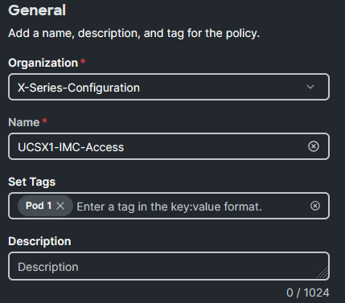
</figure>

Choose **In-Band Configuration**, type **70** in the **VLAN ID** field, ensure **IPv4** is selected, click **Select IP Pool**, choose **UCSXKVMPool**, click Select, then click Create:

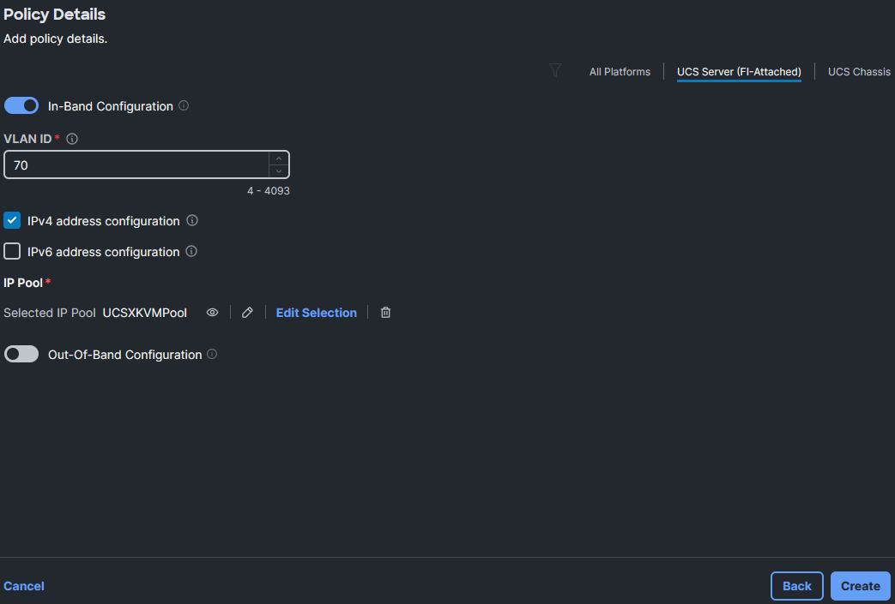

Next to **SNMP**, click **Create Policy**, provide a name, set the tag, and click **Next**:

<figure>
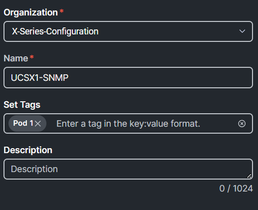
</figure>

Enable **SNMP**, type **161** in the **SNMP Port** input box, and click **Create**.

<figure>
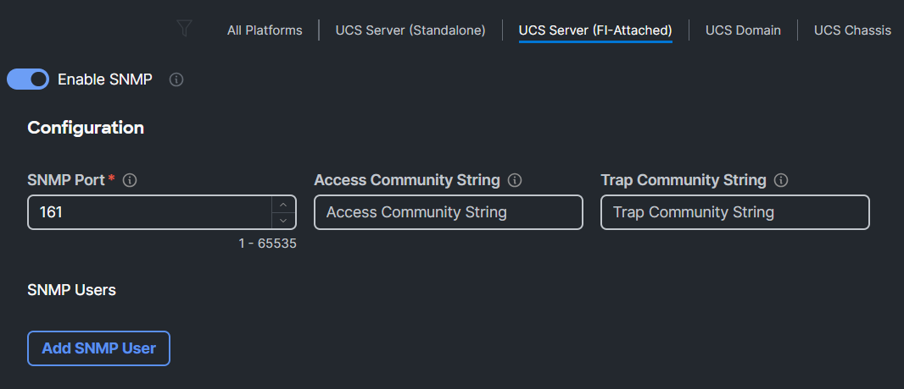
</figure>

Next to **Syslog**, click **Create Policy**, provide a name, set the tag, and click **Next**:

<figure>
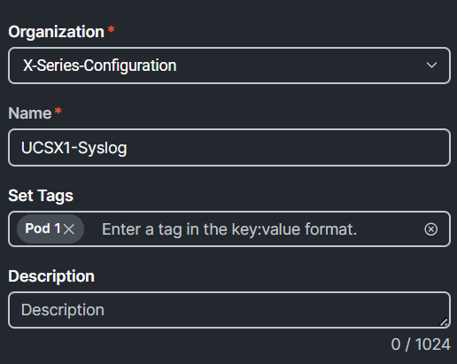
</figure>

**Enable** Syslog Server 1, input **172.20.10.10** in the **Hostname/IP Address** input field, select **Warning** from the **Minimum Severity to Report** dropdown box, and click **Create**:

<figure>
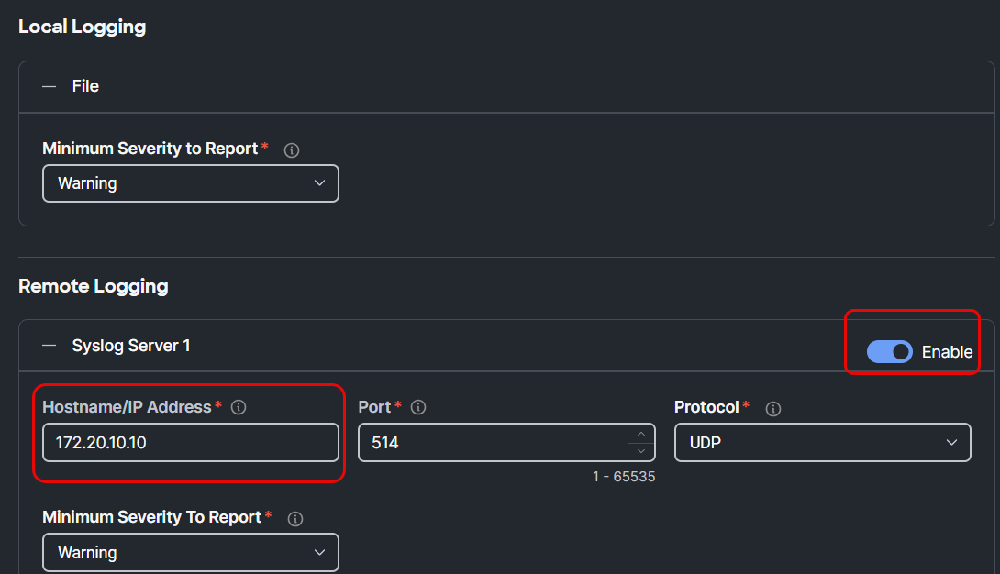
</figure>

Next to **Virtual KVM**, click **Create Policy**, provide a name, set the tag, and click **Next**:

<figure>
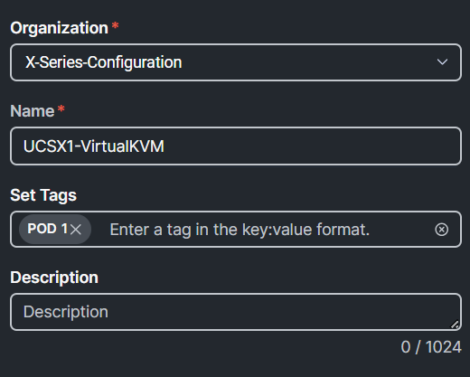
</figure>

Enable **Allow Tunneled vKVM** to settings and click **Create,** then click **Next** to proceed to the **Storage Configuration**:

<figure>
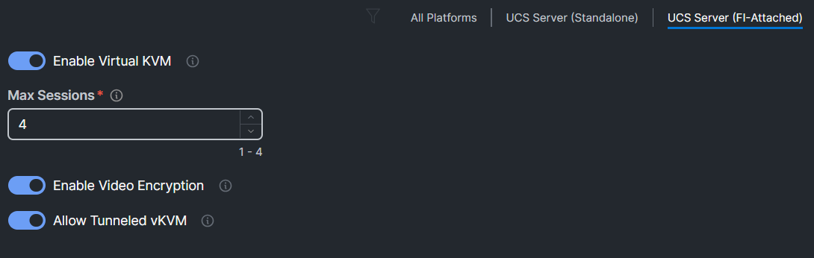
</figure>

Next to **Storage**, click **Create Policy**, provide a name, set the tag, and click **Next**:

<figure>
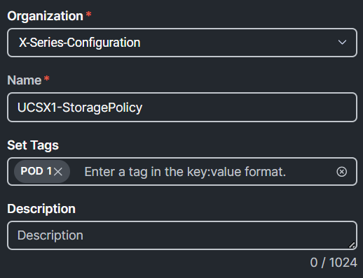
</figure>

**Enable** the **M.2 RAID Configuration**, select **MSTOR-RAID-1**, click **Create,** then click **Next** to proceed to the **Network Configuration**:

<figure>
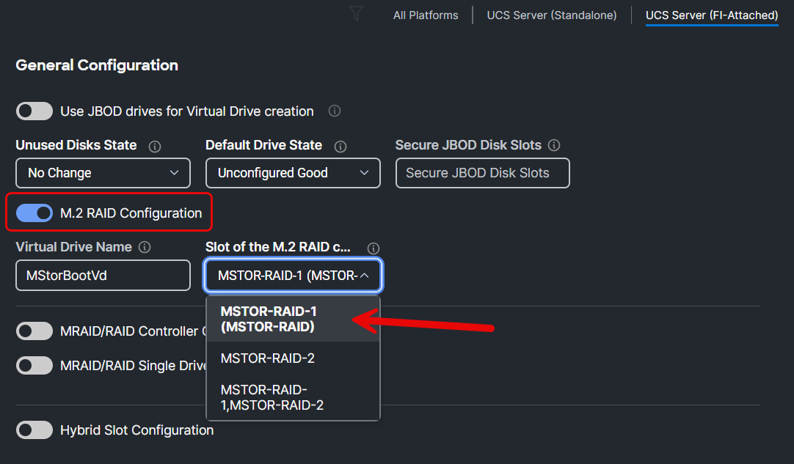
</figure>

**Best Practices and Recommendations:**

- When migrating a server any existing storage configuration will remain intact when the server is discovered in Intersight.

- Intersight will never automatically delete a Virtual Drive unless defined to do so in a scrub policy.

- If a scrub policy is not defined, existing Virtual Drives can be removed by manually deleting them from the Intersight server inventory and rebooting the host.

- Intersight does not support explicit deletion of Drive Groups. Drive Groups are auto removed if they are empty.

- If no storage policy is attached to the profile the existing drives will be discovered by the host. A server will also likely boot successfully from an existing UEFI Boot Drive.

- If a storage policy is applied from Intersight it will ONLY create new drives or adopt existing drives if the configuration matches.

- For the M.2 HWRAID module you simply toggle the setting in the storage policy.

- Un-toggling the M.2 HWRAID option will NOT remove an existing Virtual Drive.

- If a Virtual Drive is defined in the storage policy RAID section and matches an existing volume the existing volume will be “adopted” by the policy.

- What this means is, nothing will happen, but the policy deploy will succeed.

- If the drive name is the same, but the settings are different (RAID level, size, included drives) the policy deploy will fail.

- Any existing volumes that do not appear in the policy by name will be left as-is on the controller.

- If there is not an existing volume with the same name a new volume will be created.  Deploy will fail if there is insufficient space or any of the physical drives are used in a different drive group configuration.

- Decommissioning or recommissioning operation will not delete the RAIDs or data on the disks.

- Be careful to review the Server Inventory, particularly Storage Controller and Drive Population in the Server before creating the IMM Storage Policy

- Storage Policy Help: <https://www.cisco.com/c/en/us/td/docs/unified_computing/Intersight/b_Intersight_Managed_Mode_Configuration_Guide/b_intersight_managed_mode_guide_chapter_0110.html#Cisco_Reference.dita_dc8f2e67-3c8c-46fa-9103-81f51f6e8387>

- Boot from Local Storage: <https://www.cisco.com/c/en/us/support/docs/servers-unified-computing/ucs-infrastructure-ucs-manager-software/218160-configure-boot-from-local-storage-in-int.html>

Next to **LAN Connectivity**, click **Create Policy**, provide a name, set the tag, and click **Next**:

<figure>
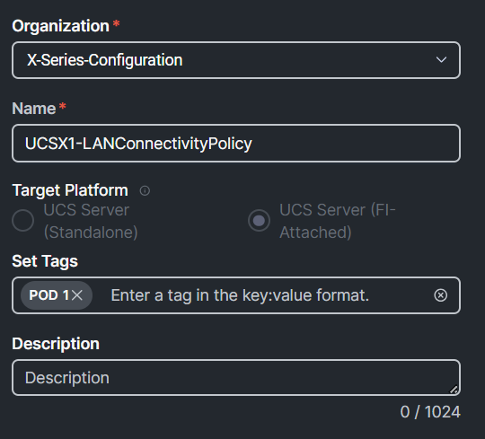
</figure>

The vNIC placement can be done via manual configuration or Auto vNIC Placement. We are going to create the vNIC Placement Manually.

<figure>
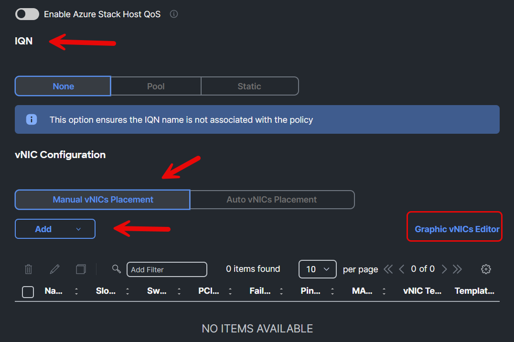
</figure>

Click add and select vNIC from Template

<figure>
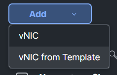
</figure>

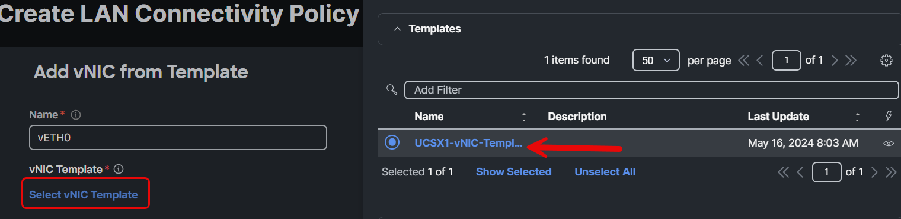

Give it the name **vETH0.** Now you see the settings from the template already populated.

<figure>
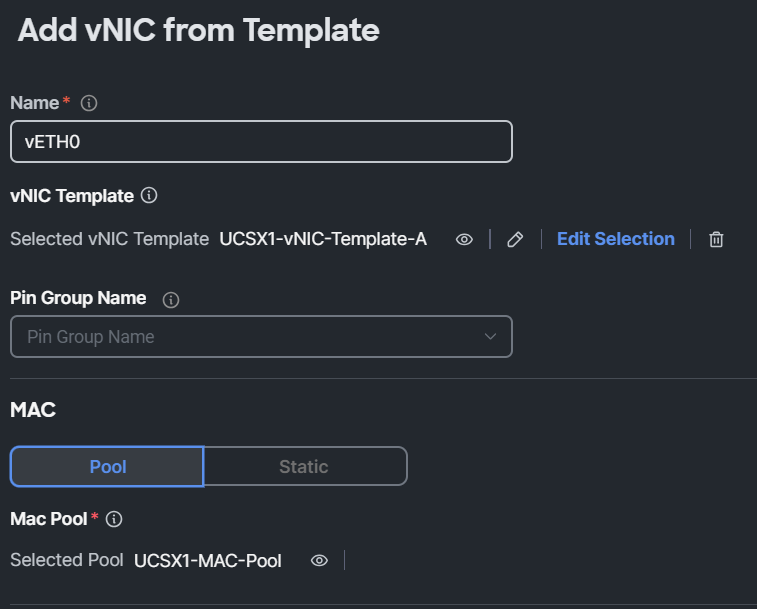
</figure>

Scroll down and ensure the PCI Order is set to **0** then click **Add**:

<figure>
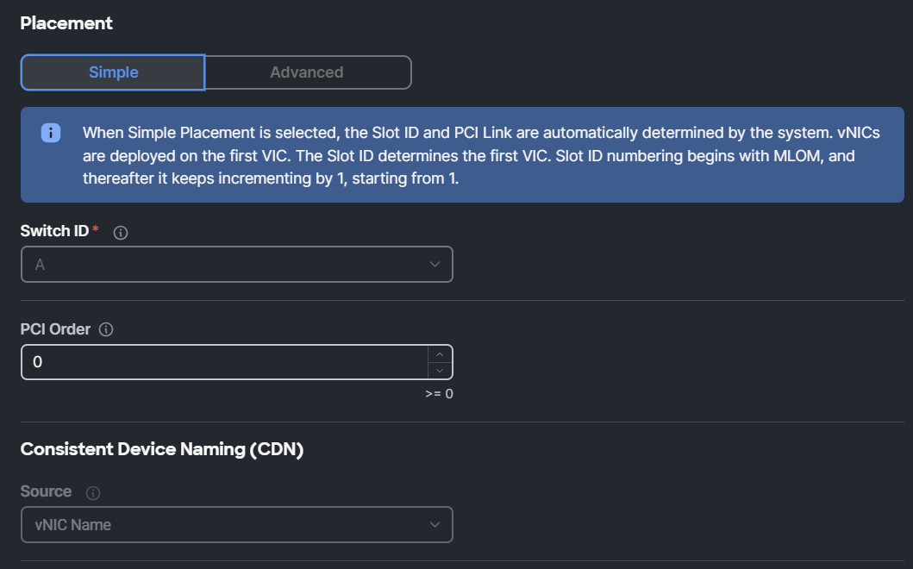
</figure>

Click on **Graphic vNIC Editor** to view a graphical representation of the connectivity:

<figure>
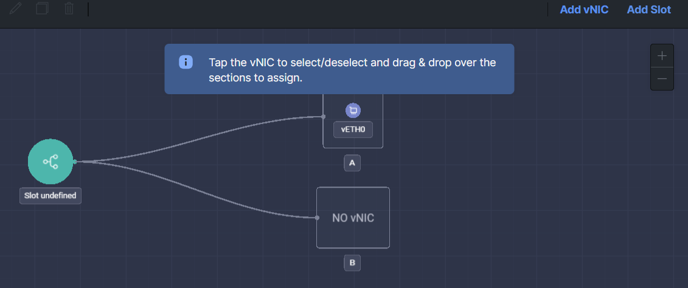
</figure>

Click on **Save**, then click **Create**.

Because of the hardware failover that is configured in the vNIC Template, you don’t have to create vETH1.

**Best Practices and recommendations:**

- Auto vNIC Placement:

  - The system defines the adapter placement and PCI order

  - Great for single adapter Blades/Servers. vNICs precede vHBAs.

  - With Auto-placement, if more than one adapter is being used the neely created vNICs are distributed across both adapters during Server Profile deployment.

  - If using Auto vNIC placement ofr LAN Connectivity Policy, you must chose Auto placement for SAN Connectivity policy. You cannot mix placement options.

- Manual vNIC Config with Simple Placement

  - You must select PCI order and it has to start with 0 for the first PCIe device. The unique numbering is per adapter.

  - It allows system to automatically determine the Slot ID and PCI Link.

  - Do not use simple placement when having dual PCI link VICs

<!-- -->

- Manual vNIC Config with Advanced Placement

  - Select PCI Order and Slot ID & PCI Link

  - Slot ID corresponds to the adapter in the Node. Numbering starts with the MLOM and then can be 1-15 afterwards. Single Adapter configuration can be just MLOM

  - PCI Link should be 0, unless you are dealing with a Dual PCI Link.

  - PCI Order must start with 0 and the numbering is unique per adapter. This should be honored across LAN and SAN Connectivyt Policies.

Next to **SAN Connectivity**, click **Create Policy**, provide a name, set the tag, and click **Next**:

<figure>
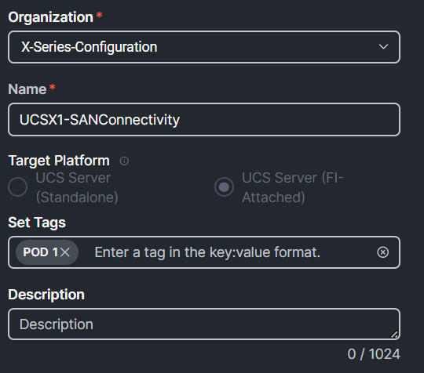
</figure>

Under WWNN Pool, click **Select Pool** and then click **Create Pool**. Provide a name, set the tag, and click **Next**:

<figure>
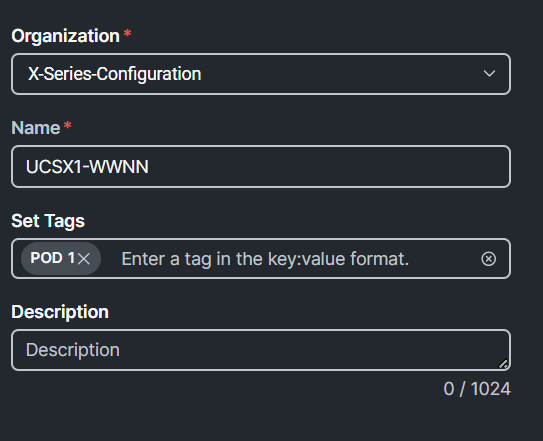
</figure>

Fill in a block as you did for the WWPN pool, starting with 20:00:00:25:B5 using your pod number and a size of 8, then click **Create**:

<figure>
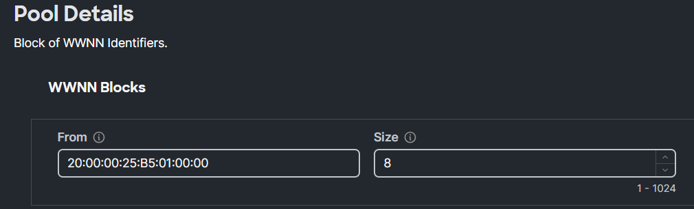
</figure>

Click on Add and select vHBA from Template:

<figure>
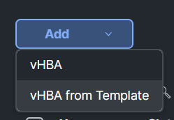
</figure>

Give the vHBA a name with A at the end. Click **Select vHBA Template**, choose the VSAN-A template you created earlier, then click **Select**:

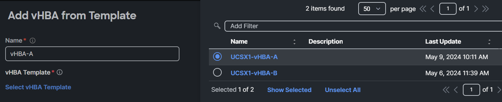

Change the **PCI Order** to **1** (0 is already being used by the vETH0), then click **Add**:

<figure>
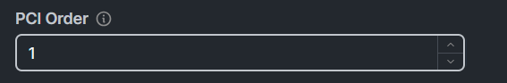
</figure>

Perform the same steps to create vHBA-B and do not forget to change the **PCI Order** to **2.**

The final result should be:

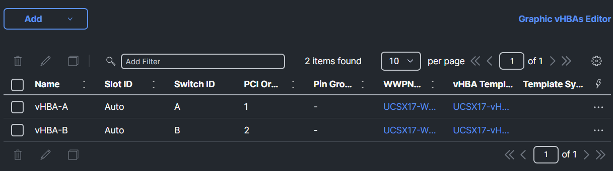

Click **Create** and then click **Next.**

You will see something like:

<figure>
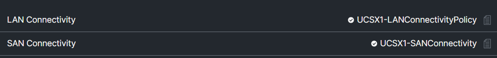
</figure>

You will see the **Summary.** At the bottom of the screen, you see close. If you click on it, the UCS Server Profile Template is created. Select **Derive Profiles**.

Select your server that is assigned to you and click **Next**:

<figure>
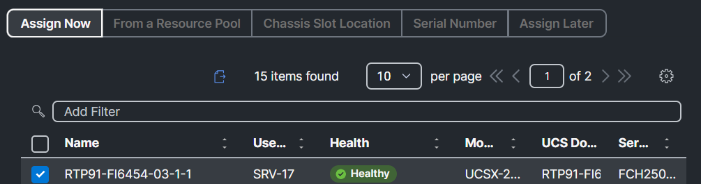
</figure>

Change the Name to something unique to your Pod and click **Next**:

<figure>
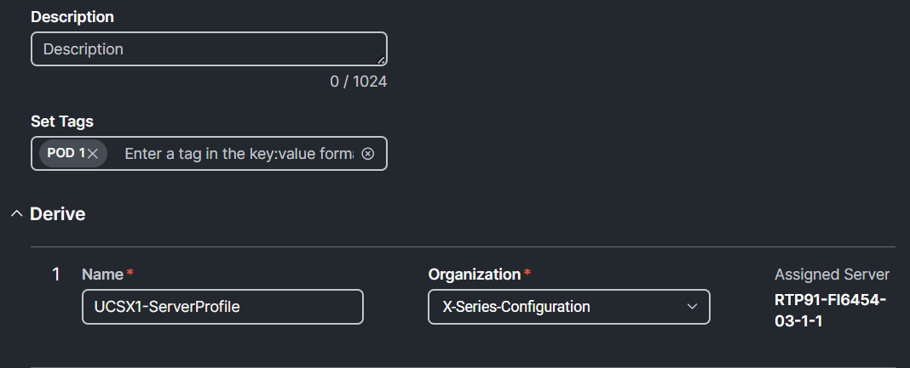
</figure>

Verify the accuracy of the Summary provided, once verified, click **Derive**.
