# Task 6: Deploying Server Profiles

Now that we have a UCS Server Profile Template, and we have derived a server profile from it, we can assign it to a physical server.

On the left side of your screen, navigate to **Configure** -\> **Profiles** and you will see the status **Not Deployed** next to your server:

<figure>
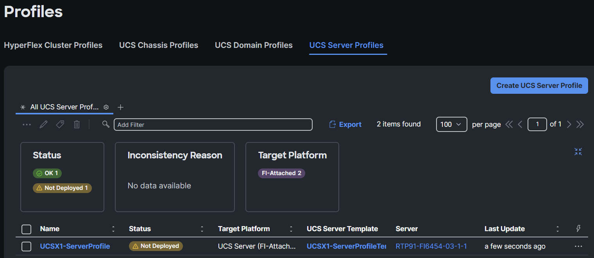
</figure>

Click the three dots on the right and click on **Deploy:**

<figure>
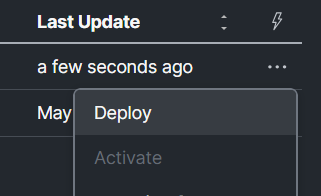
</figure>

A warning message will appear. Select **Reboot Immediately to Activate** and then click **Deploy:**

<figure>
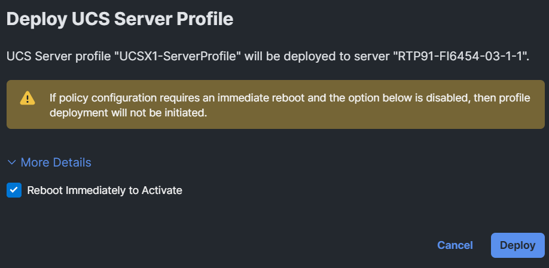
</figure>

A green message will appear for a couple of seconds in the browser.

<figure>
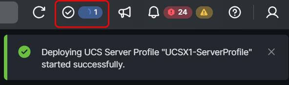
</figure>

Click on the checkmark icon at the top of the browser to see the status:

<figure>
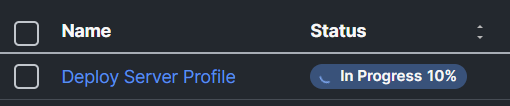
</figure>

If you click **Deploy Server Profile**, you see a bit more information:

<figure>
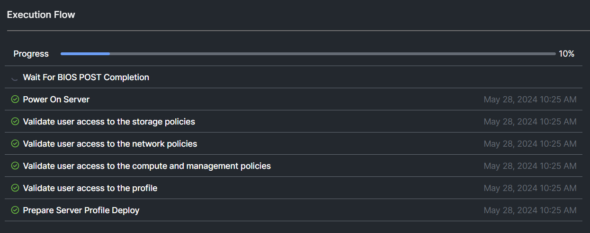
</figure>

Go back to the server profiles and you see the validation state.

<figure>
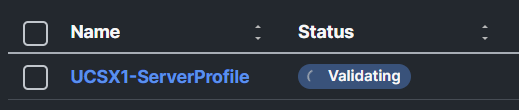
</figure>

If you see a checkmark at the top and you only see “Validating”, just click templates and go back to Profiles:

<figure>
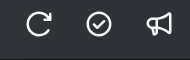
</figure>

After a while you will see the status Activating:

<figure>
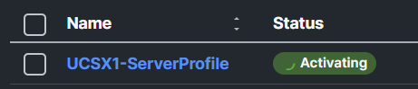
</figure>

Have a nice break and ask questions to the proctors. They are here for you. After about 15-20 minutes, the server profile is deployed and you will see OK.

<figure>
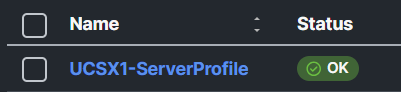
</figure>

If you see a Failed status, click on it and investigate what the problem is.

The proctors can help you.

<figure>
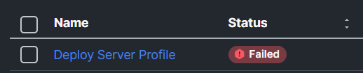
</figure>

### Task 5: Install Operation System

Start with this task only when your Server Profile is deployed on your server and has the status OK.

There are different ways to install an operating system on a server:

- KVM console

- Mount a local ISO and boot to it

- software repository

In the next steps, we will install the OS on the server via the “Install Operating System” option.

There are several ISOs in the software repository. This can be found under **System / Software Repository:**

<figure>
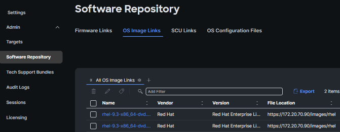
</figure>

## Step 1: Install OS

Navigate to **Operate** -\> **Server, click the three dots found** to the right side of the screen next to your server, and select **Install Operating System**:

<figure>
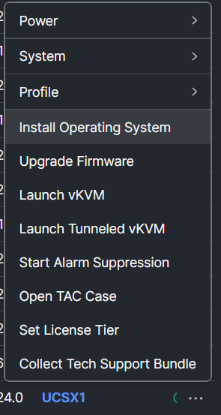
</figure>

Make sure only your server is selected and click **Next**:

<figure>
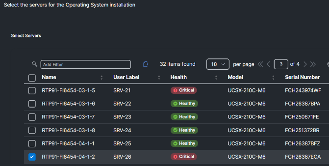
</figure>

Select the **VMWare80** OS image and click **Next**:

<figure>
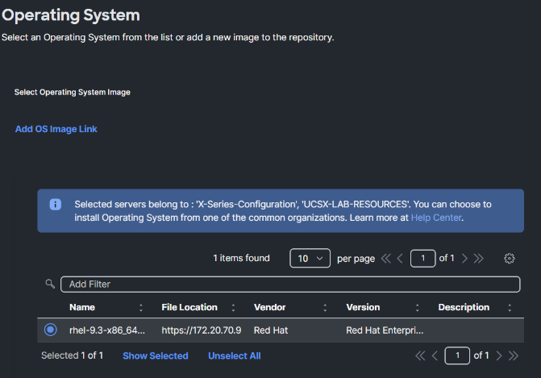
</figure>

Do not change the “Select Configuration Source’

Change the IP configuration to **DHCP**, fill in the hostname with your Server ID, use **UCSX@Cisco123** as the password, and click **Next**:

<figure>
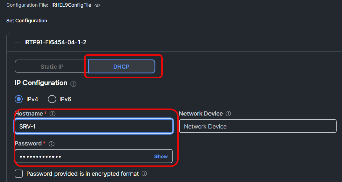
</figure>

This method needs SCU to install the OS. For this lab, the SCU image is already uploaded. Select the SCU and click **Next**.

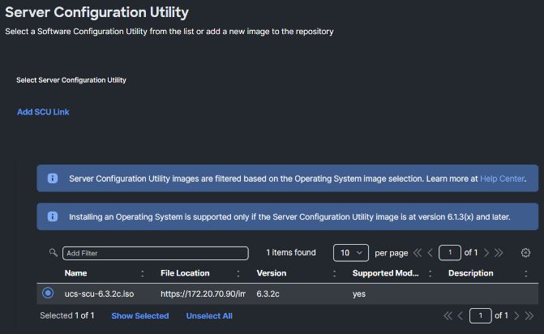

Depening on the server configuration, there are multiple ways to install the OS on a disk. For this lab, configure the installation target to use the M.2 drives and click **Next**:

<figure>
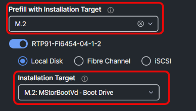
</figure>

The view you have right now is the summary. Click on **View Details** for a bit more information.

<figure>
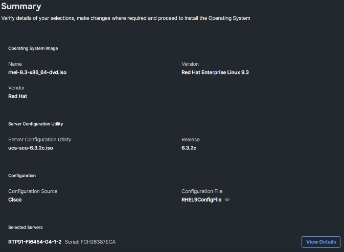
</figure>

Click **Install,** then click **Install** again on the warning message:

<figure>
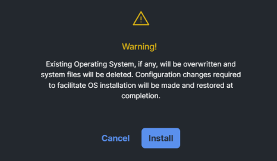
</figure>

The installation will start.

<figure>
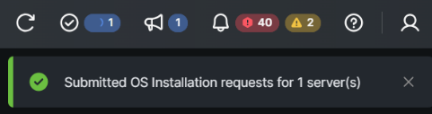
</figure>

To view the progress, you can click the checkmark at the bar or og the the server KVM Console.

Go to the **Server** view and select the three dots to the right of your server. **Select Launch Tunneled vKVM**. This features doesn’t require a VPN connection to the network where the server is located.

<figure>
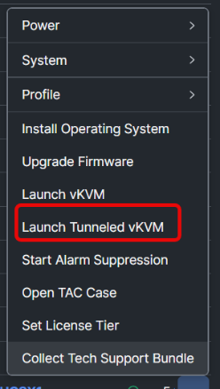
</figure>

Another web browser tab is opened. It is possible you won’t see anything for a couple of minutes. **The total installation can take between 45 and 60 minutes.** Feel free to proceed with the rest of the lab and come back later for further review.

Below is an example of what you should see in the KVM window once the OS is installed. Note the servername and IP address (should be in the range of 172.20.70.x/24)

<figure>
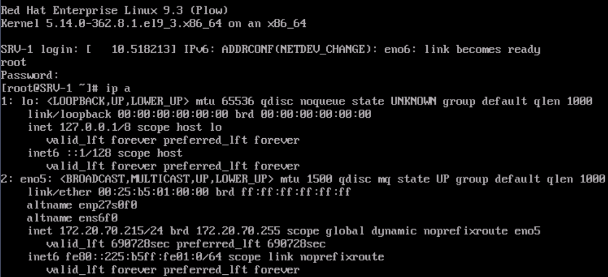
</figure>

## Step 2: Server Inventory after OS Installation

Now that the server has a profile and the OS is installed, let’s go back to the server and have a closer look at what more information you will see right now.

Click on **Servers** and **select your server.** This will direct you to the general properties of the server:

<figure>
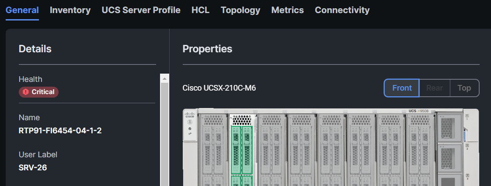
</figure>

Click on **HCL**. The server software compliance should show incomplete. The OS was installed, but the drivers weren’t installed. Click **Get Recommended Drivers:**

<figure>
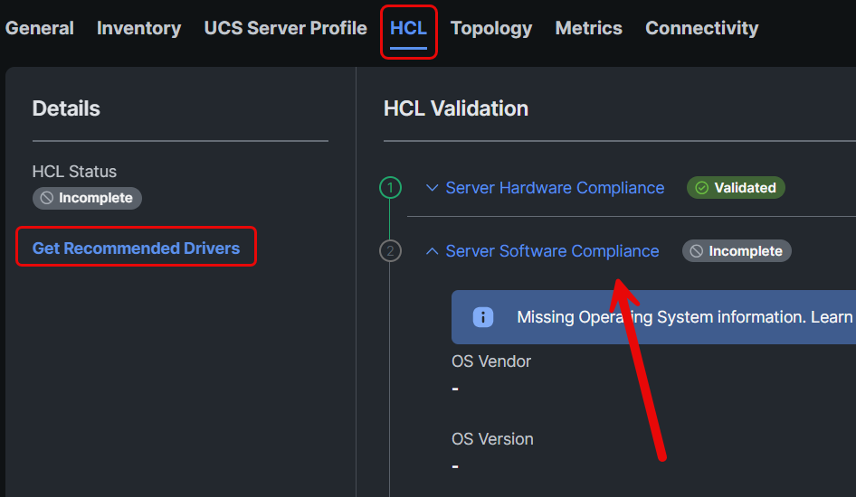
</figure>

Select OS Vendor: **Red Hat** and the OS Version is **9.3. Intersight will show** the recommended driver versions and will provide a link for downloading the driver ISO. We will not download the ISO for this lab. Click **Close**:

<figure>
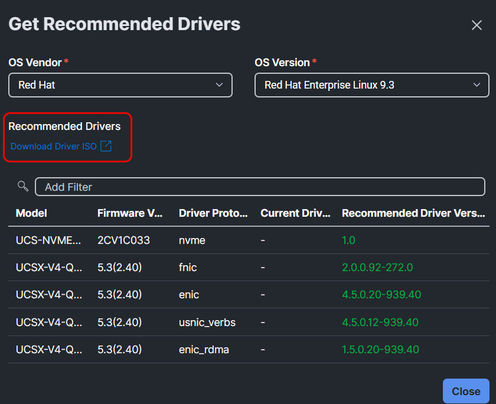
</figure>

Click the **Topology** tab. Prior to deploying a server profile, an image of the FIs and IFMs were displayed but now that a Server Profile and OS have been deployed to the server, you see the vNICs connection to the IFM:

<figure>
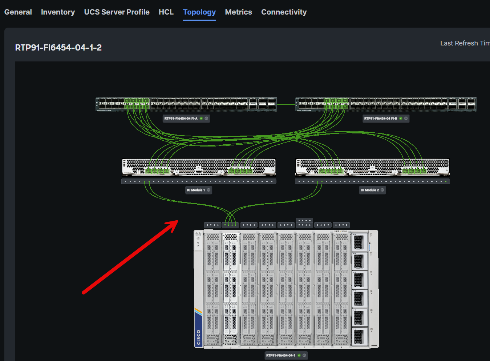
</figure>

Now click the **Connectivity** tab. This should display vETH0 and vETH1 are up and running but vHBA-A and vHBA-B are down:

<figure>
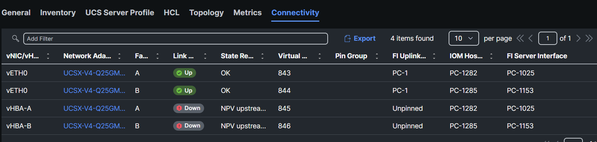
</figure>
