# Task 7: Metrics

Cisco Intersight collects metrics for devices that are part of an Intersight Manage Mode (IMM) or UCSM Managed (UMM) domain. Only environmental metrics are collected for UMM devices. The collected metrics are then exposed as widgets on dashboards, and can also be analyzed using custom metrics explorations.

## Step 1: Dashboard Metrics

The main **Dashboards** page will show several Dashboards that can be added or removed to suit the particular account. In this account, these dashboards include various metrics and metric widgets. These metrics include **Power & Energy Metrics, Fabric Interconnects Metrics, and more.**

<figure>
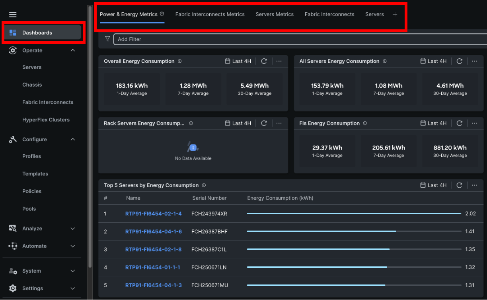
</figure>

In this lab we will go over **Power and Energy Metrics, Fabric Interconnects Metrics, and Servers Metrics.**

<figure>
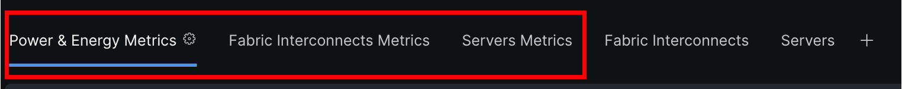
</figure>

Take a look at this page and try to understand which values could be useful for your own environment.
Would you like to know the overall Energy consumption for the account, or for just the Servers?

Select **Power & Energy Metrics**

There are many different types of widgets. You can edit and add relavant widgets to the Dashboard as required.

<figure>
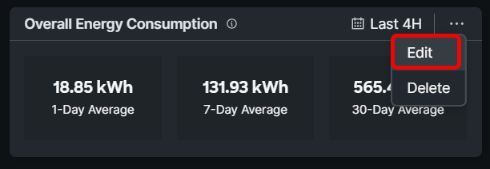
</figure>

You can also modify the information for a given widget. 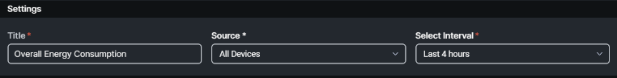

## Step 2: Fabric Interconnect Dashboard Metrics

The Fabric Interconnects have many ports and network metrics can provide details about these ports. For example, you may be interested in checking for any network congestion. 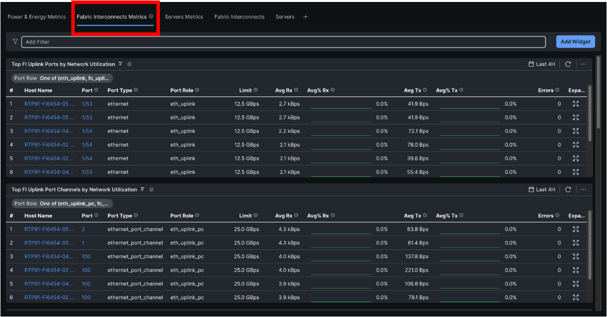

Figure

Clicking on any FI port in the main view will take you to the **Ports and Port Channels** page for the respective Fabric Interconnect:

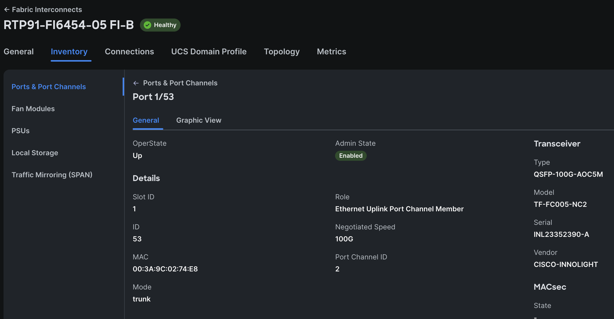

Figure 213

Navigate back to the main **Dashboards** page. If you scroll down towards the bottom of the page, you will see several other useful widgets. For example, the widget below shows if there are any errors on any of the server ports.

<figure>
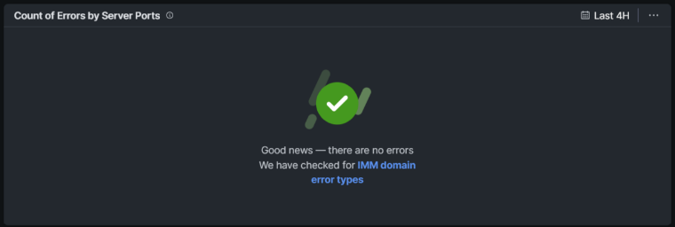
</figure>

## Step 3: Dashboard Server Metrics

The next Dashboard metrics we will cover are the **Servers Metrics**. The current dashboard shows only Temperature metrics, but just like other dashboards, additional widgets can be added as desired. The current widgets show the top 5 servers as they relate to both CPU temperature and ambient (inlet) temperature. This can be an easy way to see if a particular server is having thermal or cooling problems.

<figure>
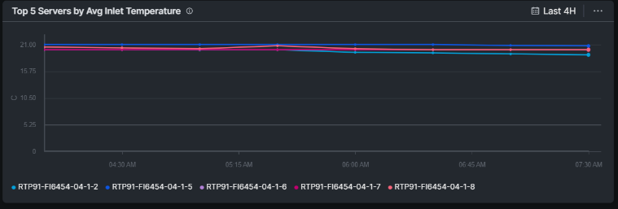
<figcaption>
Figure 215
</figcaption>
</figure>

You can modify the data displayed for the current widgets or add new widgets. To add a new widget, click the Add Widget button on the right hand side.

<figure>
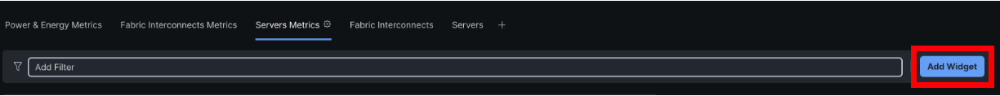
</figure>

Click the Servers checkbox, and explore the various other widgets related to Servers.

<figure>
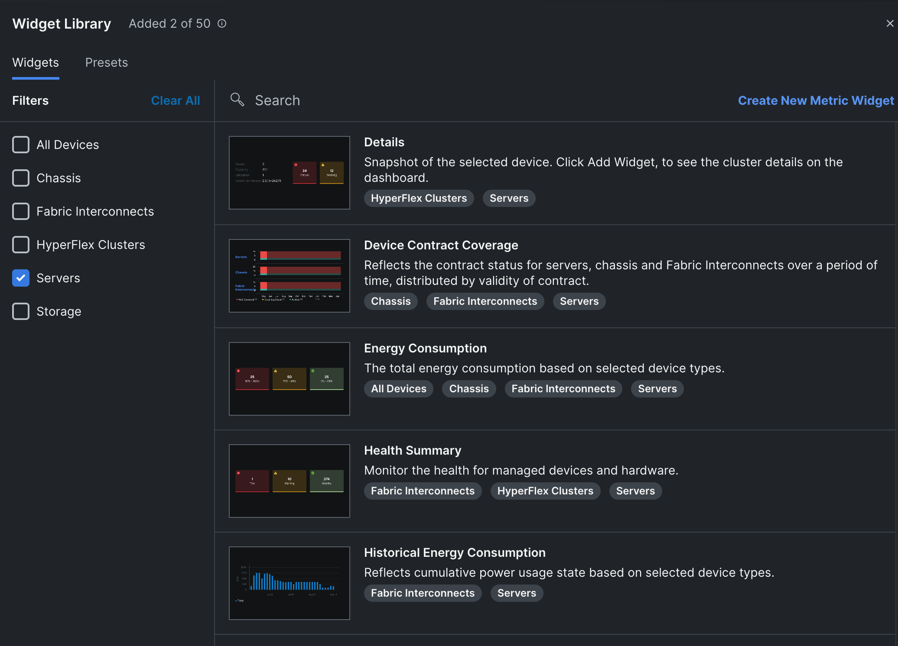
</figure>

## Step 4: Server Metrics

We are now going to explore metrics as they relate to a specific Compute device. Just like you can look at overall metrics for the entire account, there are metrics that can be explored for a single server.

Let’s go back to **Operate / Servers** and select your server.

On the bar, you see Metrics. Click it.

<figure>

</figure>

Here the Host Power and Temperature are shown.

<figure>
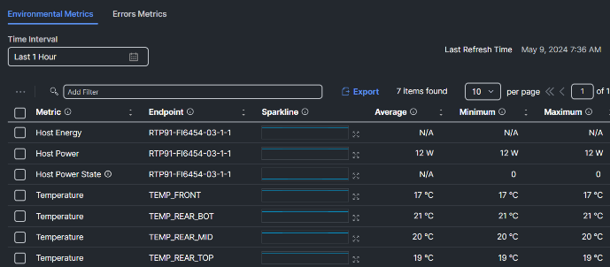
</figure>

Click on the icon next to the mini graphic of Host Power

<figure>
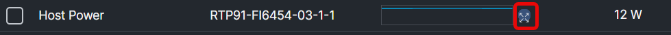
</figure>

An exploded view is now visible.

Change the **Time Interval** setting to last month.

<figure>
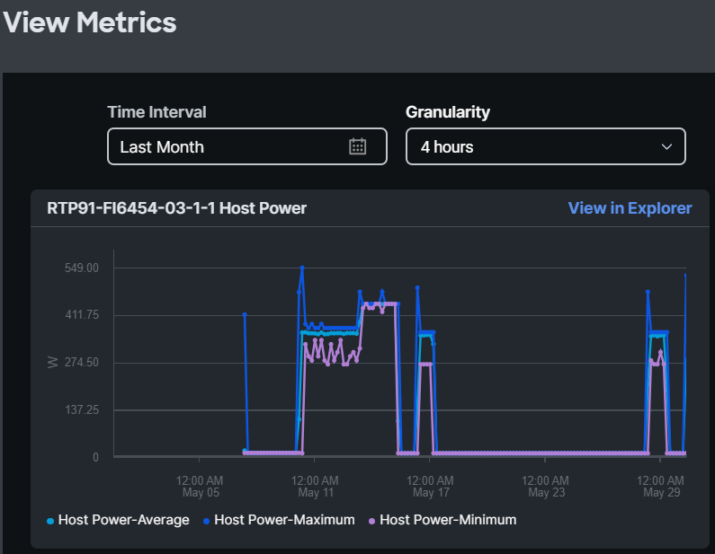
</figure>

## Step 5: Chassis Metrics

The important metrics of a chassis are the Fan Speeds, and Power consumption.

Select Chassis on the left and select a Chassis.

Click on Metrics.

For the chassis there are 28 metrics.

See what metrics are useful for you.

<figure>
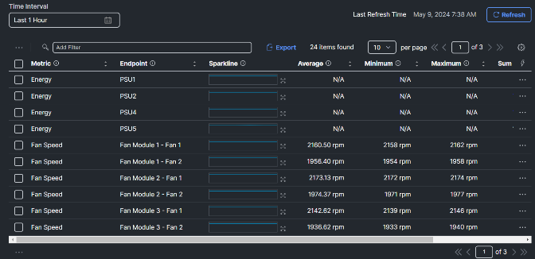
</figure>

## Step 6: Fabric Interconnect Metrics

Metrics for the Fabric Interconnect include thermals, power consumption, memory utilization and more. Navigate to the **Operate / Fabric Interconnects** section on the left and select a Fabric Interconnect.

Click on Metrics.

<figure>
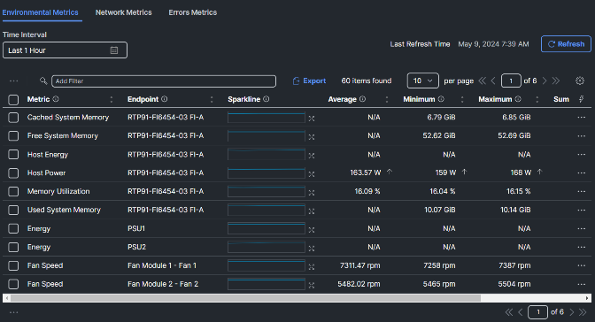
</figure>

At the top, select **Network Metrics**

**The values of the network metrics are in Bps (Bytes per second) and not bps (bits per second).**

<figure>
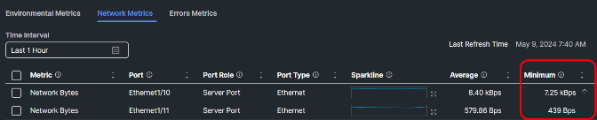
</figure>

## Step 7: Explorer

Intersight Metrics Explorer empowers you to aggregate and visualize various metrics that are collected for Fabric Interconnects, Chassis, and Servers that are managed as Intersight Managed Mode (IMM) or UCSM Managed Mode (UMM) domain in Cisco Intersight. You can use the Metrics Explorer queries to monitor your devices, optimize performance, identify bottlenecks, and proactively address any potential issues.

Navigate to the **Analyze /** **Explorer** menu on the left side**.**

<figure>
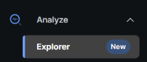
</figure>

Keep in mind, when you have the Advantage License Tier option, the data is collected every minute, but the granularity is still at 10 min.

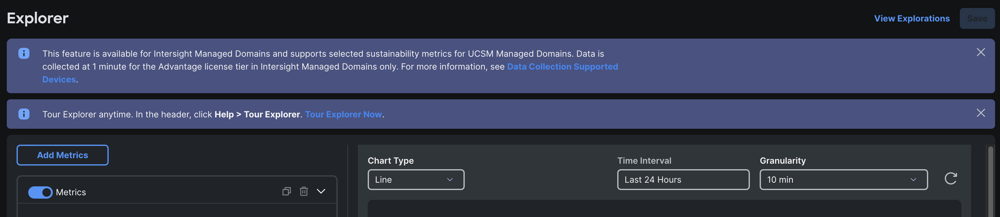

For the first metrics, we are selecting **Host Power and Status – Host Power – Maximum**

<figure>
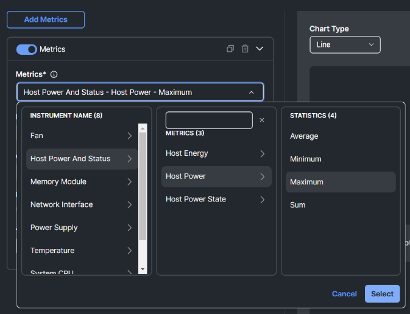
</figure>

Add a filter.
**Select Hostname and then Contains**.
Instead of selecting one device, click in the field and type: **RTP91-FI6454-05-1**(And hit enter)

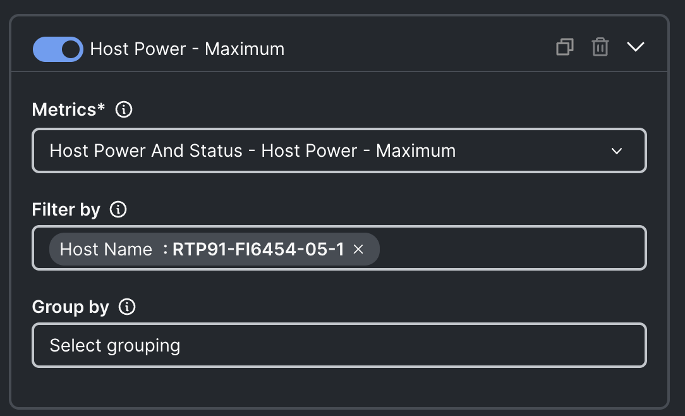

Click on “Group By” and select **Host Name**

Select a time interval of Last Month to see nicer graphs.

Here is the current result:

<figure>
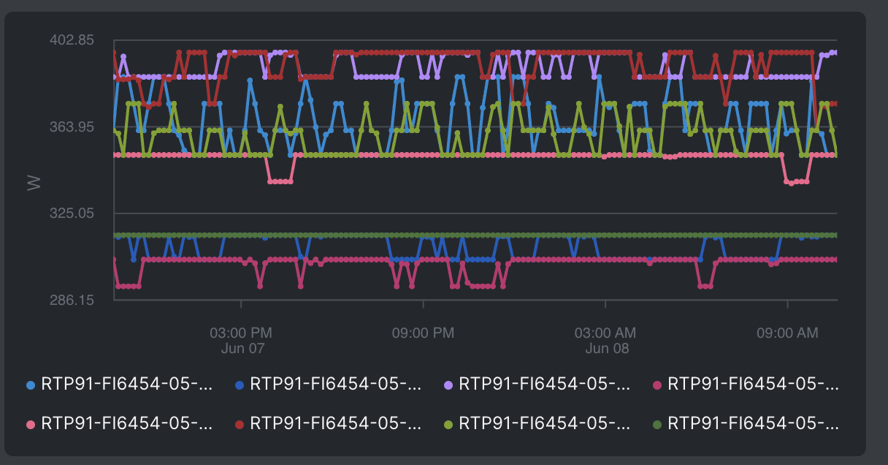
</figure>

lIf you want to have only the Top 5 shown, set the limit to 5

<figure>
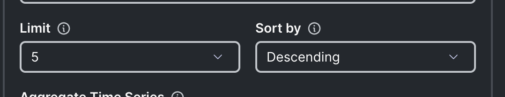
</figure>

<figure>
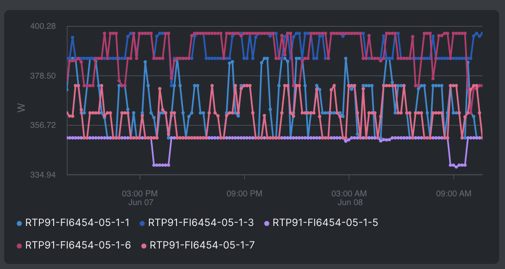
</figure>

**Disable** this metric (Slide next to “**Host Power – Maximum**” and **Add Metric** for a new metric.

<figure>

</figure>

Select **Network Interface – Operational Link Speed – Maximum**

Filter by: **Host Type equals Fabric Interconnect**

Group by: **Host Name**

Limit: **5**.

<figure>
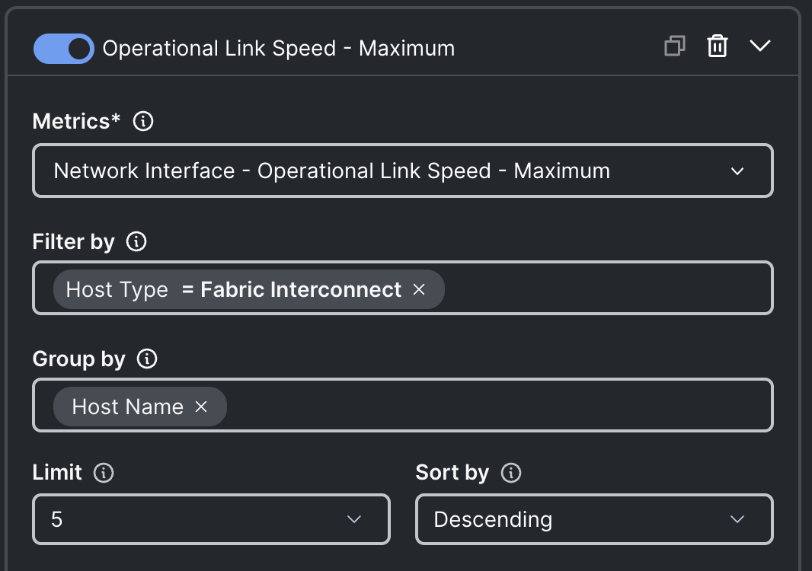
</figure>

The result you see are in Bps (Bytes per Second.)
This is for every network related metric. Keep this in mind that it is NOT bps (bits per second.)

In this case the Max link is 25 GBps or 200 Gbps.

<figure>
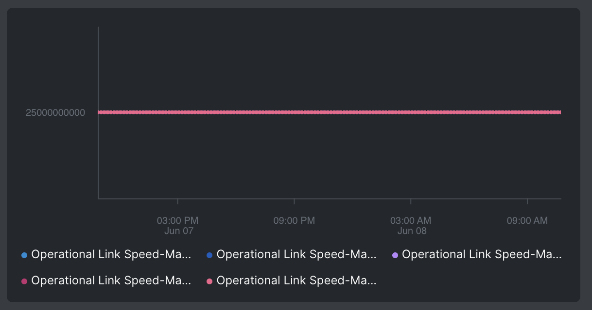
</figure>

To find the power usage of one chassis, you need to know the chassis identifier.

<figure>
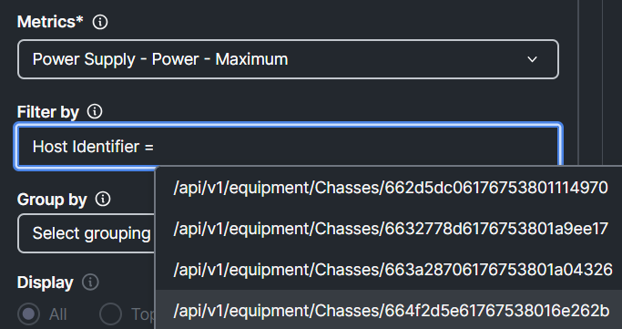
</figure>

One easy way to get this, is to go to the Chassis you want to know the details and select metrics.

Go to Chassis / Select a Chassis / Click Metrics.

Look for the Power with PSU1 as Endpoint.

Expand it and click on **View in Explorer**

<figure>
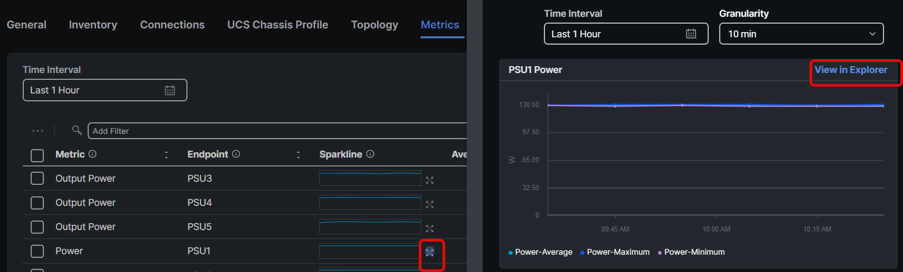
</figure>

In Explorere you will see Power- Average, Power-Minimum and Power- Maximum.

Delete the first two by clicking on the garbage bin.

Click on **Filter By** and you will see;

<figure>
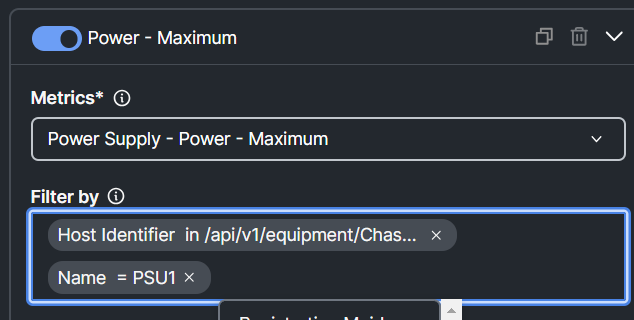
</figure>

The right Identifier is now chosen, but there is only one PSU and we want to have all PSUs to see the power consumption of the chassis.

Remove the Name = PSU1 and type in that field Name. Then select name and select contains.

<figure>
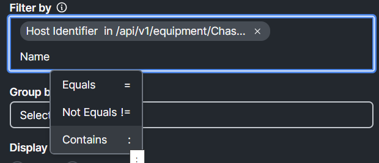
</figure>

Instead of choosing a PSU from the list, type PSU and hit enter.

<figure>
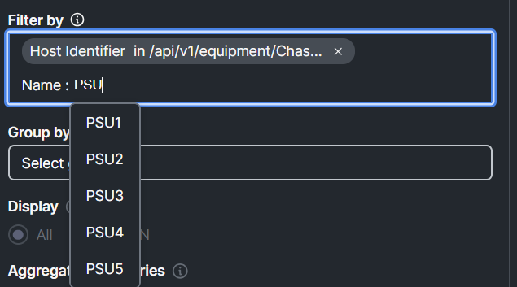
</figure>

Now you see the power consumption of the total chassis.

<figure>
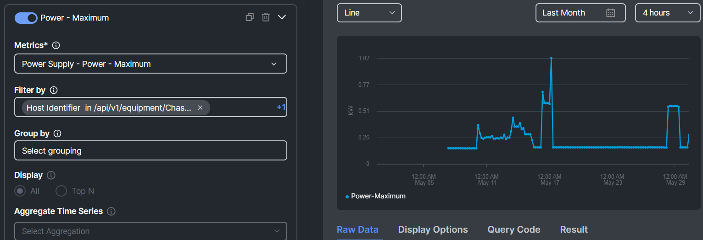
</figure>
