# Task 8: Intersight API

APIs are very useful for automation and get information quickly.

In this section we will go over the Intersight API Rest Client and how you can use it.

There are open-source applications, like **isctl** that can be used to create your own

Script/application.

## Step 1: Where to find the Intersight API Rest Client?

When you are loged in into Intersight, you can go to the Help Center.

<figure>
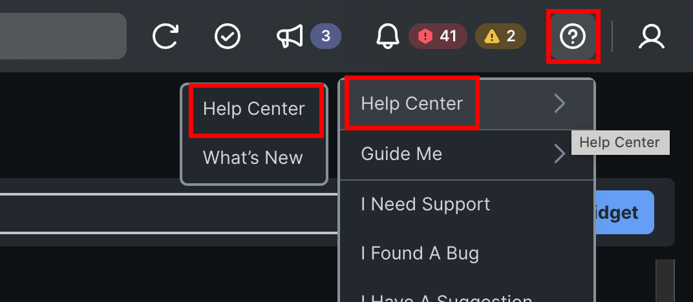
</figure>

Once you are at the Intersight Help Center, Scroll all the way down to the **Intersight Services”** and select API Documentation.

<figure>
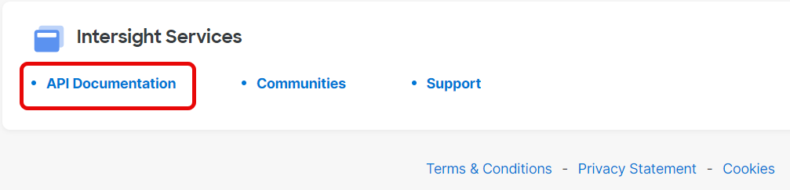
</figure>

At the top bar, click **API reference** and here you will see the API Rest Client.

<figure>

</figure>

## Step 2: Getting Chassis Information

In this step you will see how you can get information out of the API.

Find the **equipment/Chssisidentities** by using the search bar. You will see scrolling to the list is time consuming.

<figure>
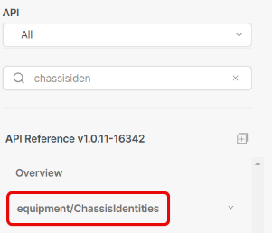
</figure>

When you open it, there are two the same get.
The top one is to get all information of all chassis in the tenant.
The second one is to get specific information of a chassis, but then you will have to know the MOID.

<figure>
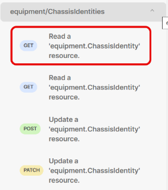
</figure>

Select the top GET and make sure **REST Client** is enabled. When it is enabled, you will see the REST Client on the right.
Click **Send.**

<figure>
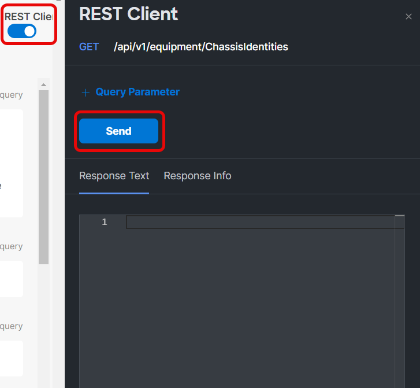
</figure>

When you see a “200 success” the API information is there.
You will see different MOID in the response and you will have to search for your chassis and MOID.
Search for Chassis you want to get more information and then copy that MOID number.

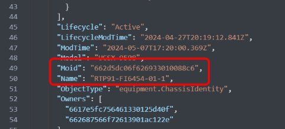

Go back to the left and now click on the second get:

<figure>
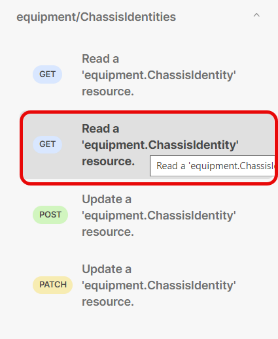
</figure>

With this get, you need the MOID that you just copied. Fill it in the {Moid} field.

<figure>
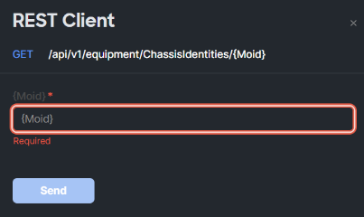
</figure>

The result is that you get only information about one chassis.

<figure>
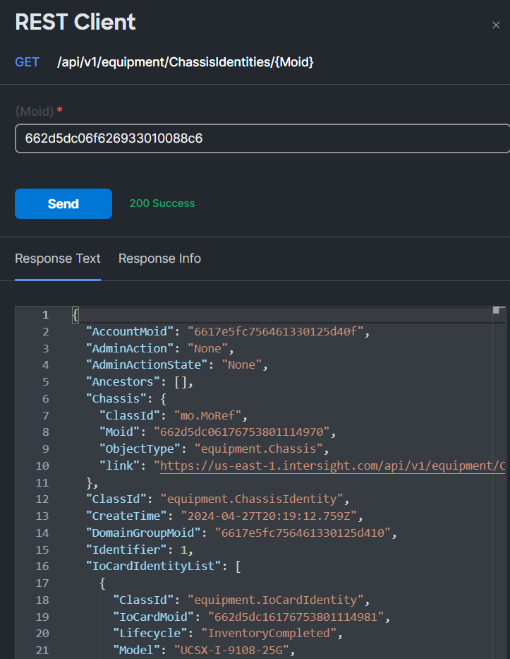
</figure>

## Step 3: Query Parameters

To get only the information you want to have, **Query Parameters** can be used.

Select the first “get” of the **equipment/Chassisidentities** and add a Query Paramter.
The Key is **\$select** and the Value is **Name, Serial**.
The Moid will be shown, eventhough it is not selected.

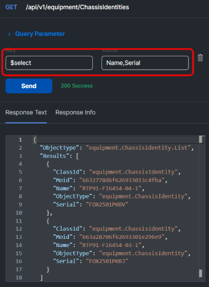

To show serial numbers and models of the servers connected to a particular Fabric Interconnect we are using the **Compute/PhysicalSummaries** API.
This will give you ideas how to use the query parameters.

Find this API in the search bar.

<figure>
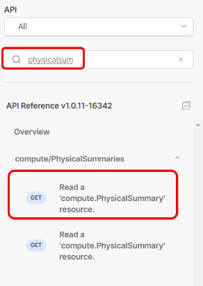
</figure>

Select the first Get and add a Query Parameter.

Key: **\$select** and Value: **Name, Serial, Model**
Then add another Query Parameter:

Key; **\$filter** and Value: **startswith(Name,’RTP91-FI6454-03-1’)**

<figure>
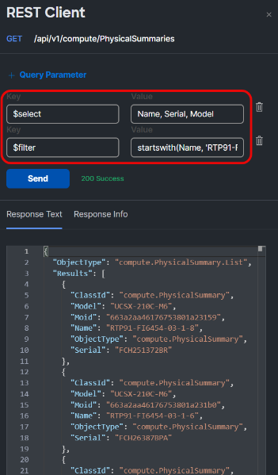
</figure>

## Step 4: Opensource tools

The Intersight REST API Client is great and it is possible to use other tools like isctl.
First you have to download it from : <https://github.com/cgascoig/isctl>

<figure>
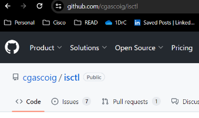
</figure>

On the right side of the webpage, click on the latest release.

<figure>
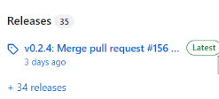
</figure>

Download the windows version.

<figure>
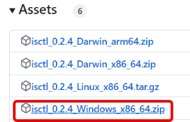
</figure>

Extract the file and copy the executable in a directory on the laptop.

<figure>
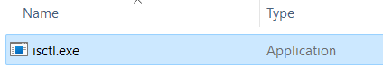
</figure>

Before you can use this application, you must have an API key of Intersight.

Go to **Intersight / Settings.**

<figure>
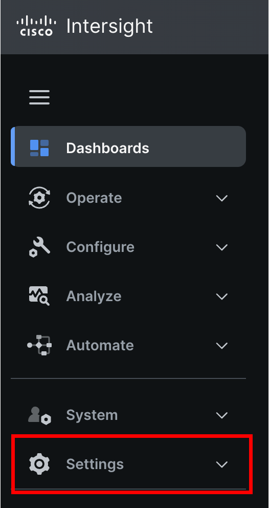
</figure>

Go to API Keys and generate an API Key for OpenAPI schema version 3. 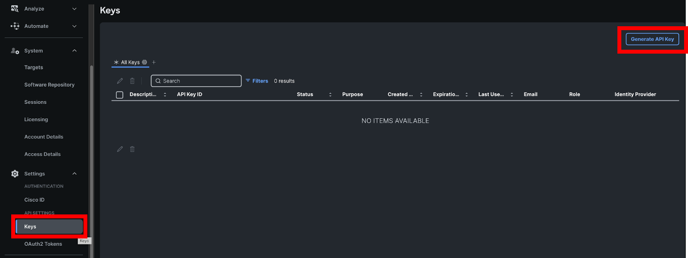

Give it a description and expiration date for the future.

<figure>
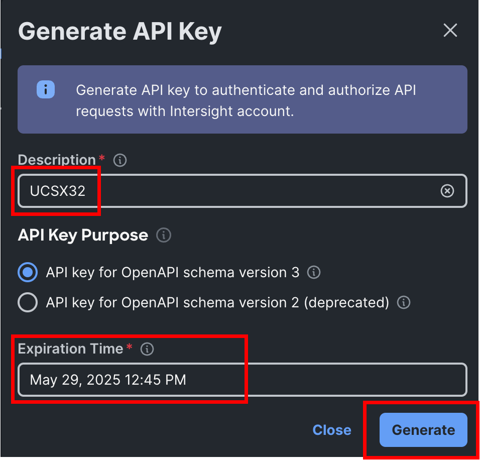
</figure>

When the API Key is generated, copy the API Key ID and download the secret key.
**Do not close this window, until you are certain the isctl application is working.**

<figure>
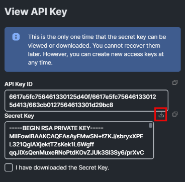
</figure>

Open the Command prompt in Windows (CMD)

And type: **isctl configure**

You will have to give the API Key ID and the location of the API secret key file.

<figure>
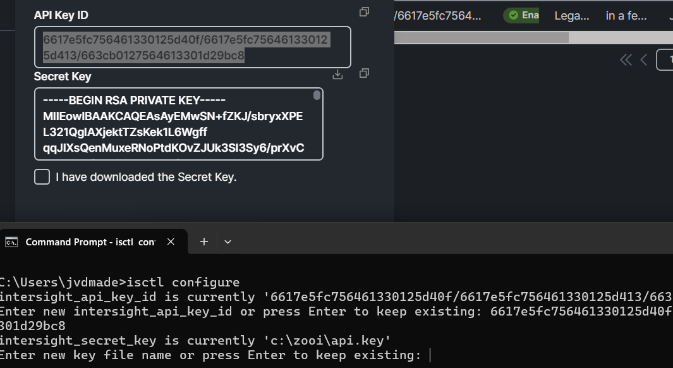
</figure>

<figure>
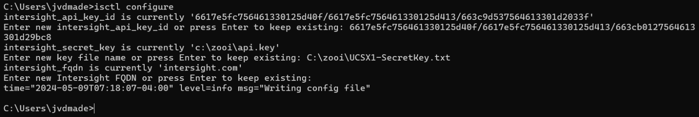
</figure>

Once that is working, you can test it by typing the following command;
**isctl get ntp policy**

<figure>
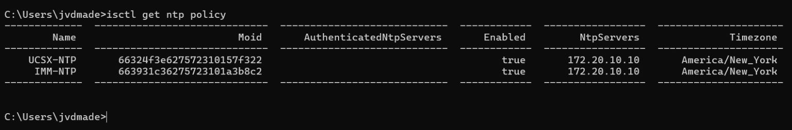
</figure>

To get the same result as the step with the filter and select query paramer, you can type:
**isctl get compute physicalsummary --select "Name,Serial,Model" --filter "startswith(Name,'RTP91-FI6454-03-1')**

There are two **–** before select and filter parameter and it is case sensitive.

<figure>
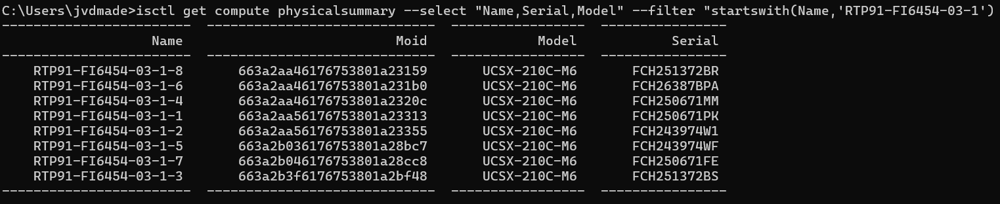
</figure>

To have the output in a certain order, you can use -o Name

<figure>
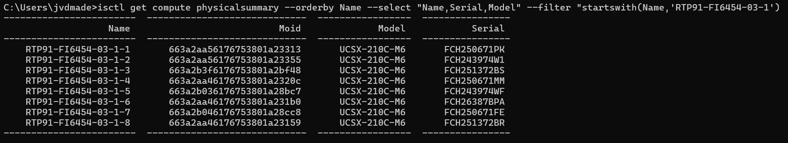
</figure>

Different outputs are possible like yaml, json, csv, xlsx.

<figure>
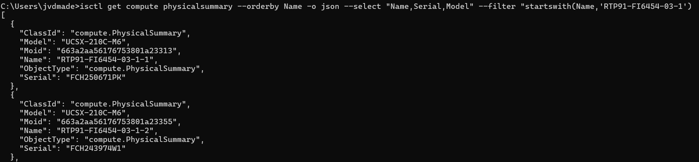
</figure>

<figure>
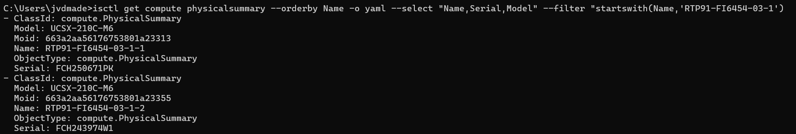
</figure>
